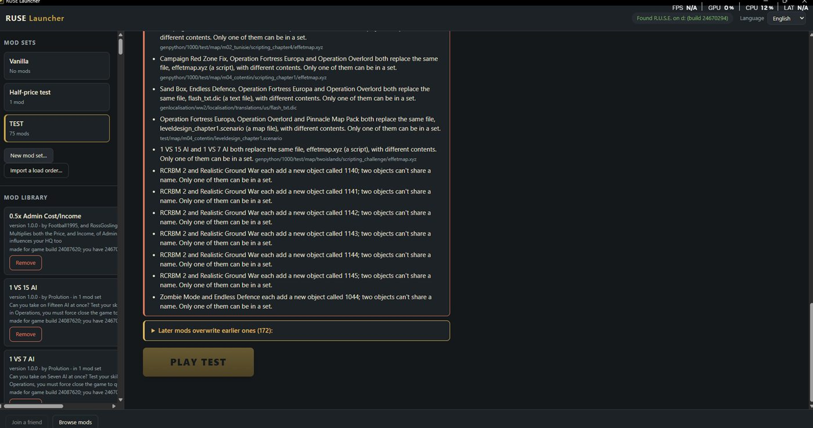
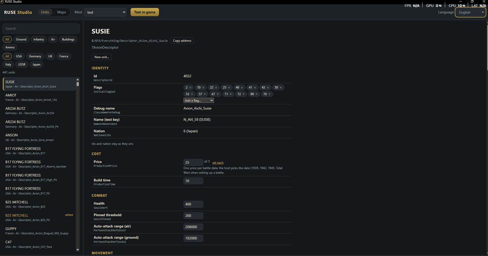
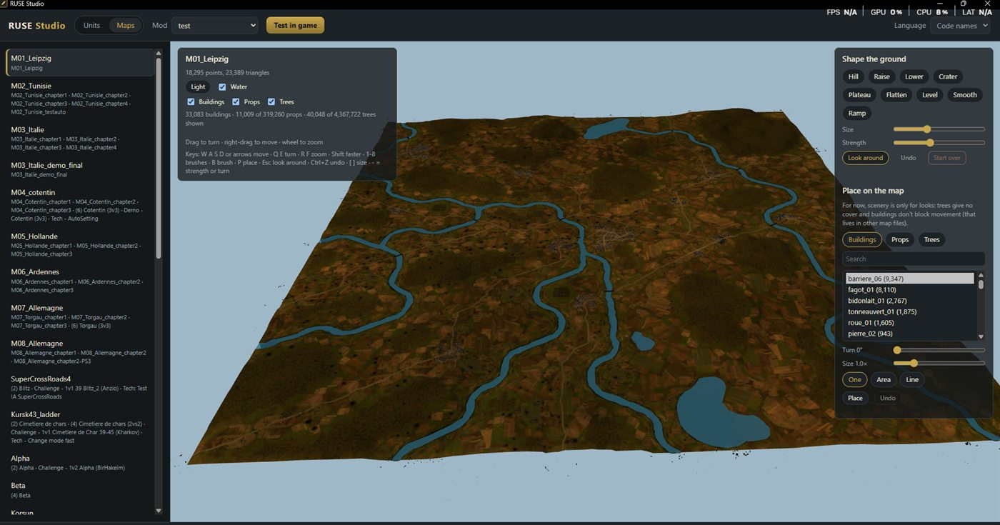

# R.U.S.E. 2.0

A foundational modding platform and player launcher for R.U.S.E. (Eugen Systems, 2010), built for the long run:
new units, maps, models, missions and one-click modded multiplayer. The content goals on top are RUSE 2.0 and Pacific Island Defense.

Status: early, and moving fast. Nothing here ever changes your game install: mods are built into a separate copy.

**Download:** [Releases](https://github.com/sneadtristen6/Ruse-Mod-Platform/releases): **RUSE Launcher 0.1.0** for
players and **RUSE Studio 0.4.1** for modders (a preview). Windows only; your browser may warn about a new download.

| RUSE Launcher | RUSE Studio (its preview mode, with sample units) |
|---|---|
|  |  |
| |  |

**Current stage (2026-09-29):**
- **New units work in-game:** a copy of the M3 Lee named "Lee C6-Test", costing $1, in the US armour factory;
  it's built and fights like any other unit (C7).
  `ruse build` gives every copied unit the class the game's Python unit list needs, under the safety rules of
  PLAN.md decision 23 (mods never carry scripts).
- **Text mods work end to end** (check C4), with new names in all ten languages (C6). The launcher's Play builds the
  modded copy and starts it.
- **Maps:** new maps can ship their own pack (C3). The terrain mesh and tile files can be read and rewritten
  losslessly, and the game draws terrain textures we write ourselves.
- **Next:** new units made from the Studio's window, then mod sets made inside the launcher, then a terrain
  editor in RUSE Studio (shape a map with brushes, then "Test in game").
- Decided: RUSE 2.0 gets a real 8th nation, China (PLAN.md §6, decision 19).

The order is in PLAN.md §10 "Now"; the latest decisions are in PLAN.md §6.

| Doc | What it covers |
|---|---|
| [docs/PLAN.md](docs/PLAN.md) | vision, principles, architecture, roadmap, risks, open decisions |
| [docs/FORMATS.md](docs/FORMATS.md) | what we know about every game file format (the project's memory) |
| [docs/MOD_FORMAT.md](docs/MOD_FORMAT.md) | draft spec of the mod package format |
| [docs/RESEARCH.md](docs/RESEARCH.md) | what others already built, and the chosen tech stack |
| [docs/LITTLEGROOVE_STUDY.md](docs/LITTLEGROOVE_STUDY.md) | what RUSE-Mod-Manager does, where it stops, and how we go further |
| [docs/ENGINE_NOTES.md](docs/ENGINE_NOTES.md) | ideas learned from studying the game's own files (esp. its Python scripting layer) |

## Code so far

Three parts, in `src/`: the engine, `rusemod` (the game's files, the mod system, building modded copies, the `ruse`
tool), and two apps built on it, `ruse_launcher` and `ruse_studio`.

- **The `ruse` tool** (`src/rusemod/cli.py`): with `PYTHONPATH=src`, run `py -3 -m rusemod <command>`
  (or `pip install -e .` once, then just `ruse <command>`). It never writes into the game folder.
  ```
  ruse detect                                   find R.U.S.E. through Steam, show build and branch
  ruse ls ZZ_GladPatchableWin.dat gfx           list files in a pack (nested packs: ZZ_Win.dat!eugen.ipk)
  ruse names ZZ_GladPatchableWin.dat Sherman    list named objects
  ruse dump ZZ_GladPatchableWin.dat everything.cpp.gladndfbin Tourelle_MG   show data as text
  ruse extract ZZ_GladPatchableWin.dat mapinfo  copy files out, into extracted/ (ignored by git)
  ruse build mymod/ other.rndf --instance D:\RUSE-Instances\test   build mods into a modded copy of the game
  ruse index build                              index the whole game once per game build (read-only)
  ruse index show $/GFX/Everything/Descriptor_Unit_M4_Sherman   an object, what uses it and what it uses
  ruse index filter TUniteAuSolDescriptor ProductionPrice[0] gt 100   units by their numbers
  ruse index clone $/GFX/Everything/Descriptor_Unit_M4_Sherman   what a copy would copy and share
  ruse index texts Sherman                      search the game's texts
  ```
  `build` takes mod folders (`mod.toml` + `src/**/*.rndf`, [docs/MOD_FORMAT.md](docs/MOD_FORMAT.md)) or single
  `.rndf` files, shows the load order and every error / warning / note, and writes nothing if there's an error.
  Value changes work end to end (C4). New objects work too: a copied unit gets its own id, debug name and build-menu
  slot ([`src/rusemod/identity.py`](src/rusemod/identity.py)); the in-game test is C5
  ([`examples/cloned-unit/`](examples/cloned-unit/), PLAN.md §7). New units get their own names from a mod's
  `text/*.csv` ([`src/rusemod/loc.py`](src/rusemod/loc.py); in-game test C6,
  [`examples/named-unit/`](examples/named-unit/)).

- **Two apps** on the engine, separate from each other (neither needs the other; PLAN.md decision 22). Both are
  desktop windows built like web pages; once: `py -3 -m pip install pywebview`. Their screens also open in a normal
  browser with made-up data: `src/ruse_launcher/ui/index.html?fake`, `src/ruse_studio/ui/index.html?fake`.
  - **RUSE Launcher** ([`src/ruse_launcher/`](src/ruse_launcher/), v0.1), for players: it finds the game, lists your
    mod sets and has a big Play button that builds the set's modded copy and starts the game (Vanilla starts through
    Steam). `py -3 -m ruse_launcher`.
  - **RUSE Studio** ([`src/ruse_studio/`](src/ruse_studio/), v0.4), for modders: browse every unit and building, see a
    unit's values, parts and what uses it, and pick a language: the game's own names by default, or any of the
    game's ten languages. Pick or make a mod and change a unit's numbers right on its page: each change is saved in
    the mod's `src/studio.rndf` (with Undo); a part several units share changes for one of them or all.
    "Test in game" builds the mod and starts the game. **Maps** (new, the start of the terrain editor): every map
    the game lists, shown in 3D with its real ground mesh and ground textures (the textures are decoded once per
    map and kept). `py -3 -m ruse_studio` (after `ruse index build`); `--spike` opens the 3D check.
  - `py -3 -m pip install -e .[apps]` once gives two commands, `ruse-launcher` and `ruse-studio`, that open them
    without a console window.
  - **Installers** ([`installers/`](installers/README.md)): GitHub builds `RUSE-Launcher-Setup-<version>.exe` and
    `RUSE-Studio-Setup-<version>.exe` on every push that changes the apps (Actions → **apps** → Artifacts). No Python
    or Git needed, no admin rights. Not signed yet, so Windows warns once ("More info" → "Run anyway").
- [`ruse_edat.py`](ruse_edat.py): read-only EDAT archive reader.
  ```
  py -3 ruse_edat.py list    <archive.dat>
  py -3 ruse_edat.py stats   <archive.dat> [...]
  py -3 ruse_edat.py extract <archive.dat> <substring> <out_dir>
  ```
- [`listings/`](listings): full file lists of all 38 archives (build 190852).
- **Mod rules engine** ([`src/rusemod/patch.py`](src/rusemod/patch.py), [`src/rusemod/resolve.py`](src/rusemod/resolve.py)):
  load order and every rule in [docs/MOD_FORMAT.md](docs/MOD_FORMAT.md) §10 (stacking, rounding, the conflict table,
  clones, shared parts, `patch every`, the final pass, `when mod`), tested on made-up data. It runs on the real game
  files through the bridge ([`src/rusemod/model.py`](src/rusemod/model.py)), which writes changed values, new objects
  and deletes back into them.
- **Fingerprints and join codes** ([`src/rusemod/lock.py`](src/rusemod/lock.py)): the multiplayer "seal number" and
  the pasteable join code from [docs/MOD_FORMAT.md](docs/MOD_FORMAT.md) §12.
- **Mod file reader** ([`src/rusemod/rndf.py`](src/rusemod/rndf.py)): reads `.rndf` mod text (MOD_FORMAT §5, WARNO
  spellings) into operations for the engine, with errors that give file, line and column.
- **New units** ([`src/rusemod/pyscript.py`](src/rusemod/pyscript.py)): the game only uses units that have a class
  in its Python unit list, so `ruse build` gives every copied unit one, from a single fixed template that's checked
  before it's written; mods can never bring scripts of their own (PLAN.md decision 23).
  [`tools/verify_pyscript.py`](tools/verify_pyscript.py) checks it against the real game.
- **Terrain** ([`src/rusemod/tms.py`](src/rusemod/tms.py), [`src/rusemod/tmst.py`](src/rusemod/tmst.py)): read and
  write the terrain mesh (heights, with a height-edit tool) and the texture-tile store. Proven lossless on every map
  by [`tools/verify_tms.py`](tools/verify_tms.py) and [`tools/verify_tmst.py`](tools/verify_tmst.py) (which also build
  the in-game test packs). In the game: our own plain texture tiles are drawn (2026-09-29). The texture tiles'
  own codec is read by [`src/rusemod/tgu1.py`](src/rusemod/tgu1.py); [`src/rusemod/terrain.py`](src/rusemod/terrain.py)
  gives the Studio the map list, the ground mesh and the stitched ground picture.
- [`tools/c3_survey.py`](tools/c3_survey.py): check C3 step 1, a read-only survey of how the game mounts packs.
- [`tools/topo_check.py`](tools/topo_check.py), [`tools/dic_check.py`](tools/dic_check.py): read-only checks of the
  TOPO and text-file leads from [docs/RESEARCH.md](docs/RESEARCH.md) §5.
- [`tools/nation_scan.py`](tools/nation_scan.py): read-only count of everything in the game data built around the
  7 nations (the data side of adding China, [docs/RESEARCH.md](docs/RESEARCH.md) §6).
- [`tools/names_check.py`](tools/names_check.py), [`tools/identity_check.py`](tools/identity_check.py): read-only
  checks before adding units: the object-name writer against every shipped file, and the fresh-identity rules
  (ids, debug names, build menus) against the unit data.
- [`tests/`](tests): tests on small made-up files, no game needed: `py -3 -m unittest discover -s tests` (with `PYTHONPATH=src`).
  GitHub runs them on every push, on Windows and Linux ([`.github/workflows/tests.yml`](.github/workflows/tests.yml)).
- [`prototypes/spike-2026-09-28/`](prototypes/spike-2026-09-28): throwaway spike code (NDF object parser, script reader).
