<div align="center">

# R.U.S.E. 2.0

**Build the battlefield, then fight on it.**

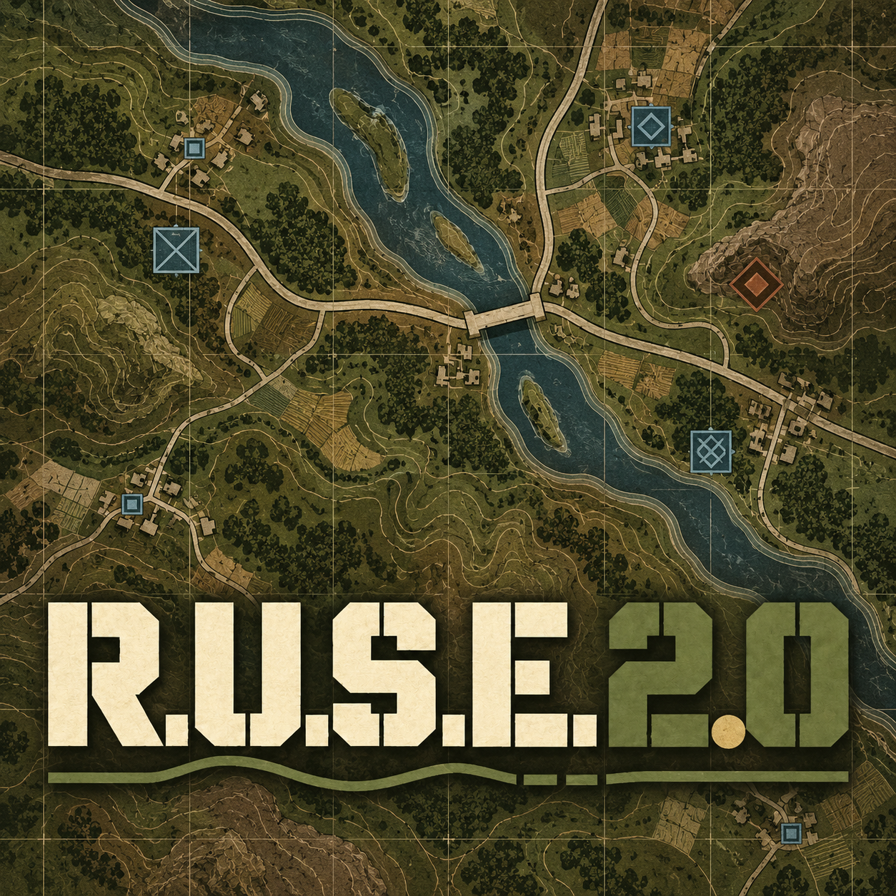

[](https://github.com/sneadtristen6/R.U.S.E-2.0-Project/releases?q=launcher)
&nbsp;&nbsp;
[](https://github.com/sneadtristen6/R.U.S.E-2.0-Project/releases?q=studio)
&nbsp;&nbsp;
[](https://www.patreon.com/SneadTristen6)

<sub>Windows. Needs R.U.S.E. on Steam. Never touches your Steam install.</sub>

</div>

## What R.U.S.E. 2.0 is

**New maps, new units and one-press modded play for R.U.S.E.** Two free apps:

- **RUSE Launcher, for players.** Pick a set of mods and press **Play**. That's it.
- **RUSE Studio, for modders.** Change any unit, make new ones with 3D models of their own, reshape a map's ground,
  draw roads and bridges, then press **Test in game**.

**A game that plays a game with R.U.S.E.** It checks your mod the way the game will read it, before the game ever
starts: anything that would break in the game is stopped first, with a note saying what to change. The goal: what you
make works in the game every time, the first time.

**Data only.** A mod here changes data, in a separate copy of the game, and that is all of it: this project is about
what changing strictly data can do. Anything beyond data is outside what we want to do with it. Your Steam install
is never changed.

**LittleGroove's tools are in the Studio.** RUSE Studio 0.9.8.1 brings over the tools of his RUSE-Mod-Manager (the
Economy and AI tabs, All values, the game's files, missions), adds a **Music** tab for songs and voice lines, and a
**Nations** tab that makes one of the game's nations into another, with a name and a flag of its own.

**New maps can start blank.** RUSE Studio 0.9.8 starts a new map as flat land or open sea, and gives any map its own
pictures in the game's menus, from a PNG or made in Blender from the map itself. Since 0.9.8.1, Blank Terrain's ground
is made as its own.

**Very large map mods now build in minutes.** Before, they took a very long time to build, and that's why this
update was needed: our most extreme map mod went from about four hours to under 10 minutes. It's in RUSE Studio
0.9.7, we're still working on optimizations, and how we got there is under [How we got here](#how-we-got-here).

**What's in this repository.** The two apps, and what players and modders need to use them. Our working notes on the
game's own files are kept private until we have an explicit OK from the developers, Eugen Systems. I've reached out
to them in hopes of working with them, and of making sure there's maximum security on this project.

Everything we do here is to help the community and bring this game to a better place. R.U.S.E. is one of my favorite
games ever, and I just want to make it better.

## See it in the game

<table>
  <tr>
    <td width="33%" valign="top">
      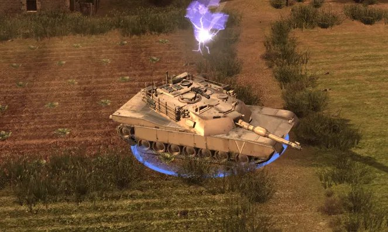<br>
      <sub><b>A tank of your own.</b> An M1 Abrams, modelled in another 3D program, in the game.</sub>
    </td>
    <td width="33%" valign="top">
      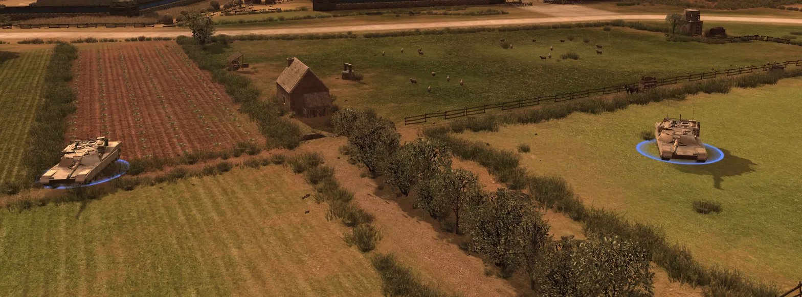<br>
      <sub><b>Out in the fields.</b> Two M1 Abrams beside a farm.</sub>
    </td>
    <td width="33%" valign="top">
      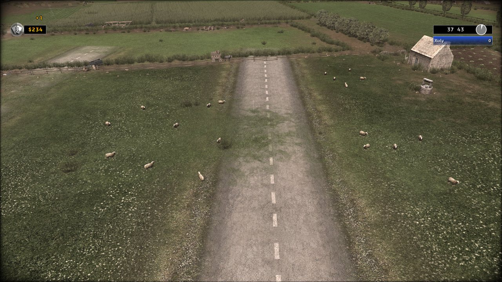<br>
      <sub><b>Roads you draw.</b> Like the map's own, from high up and right down at the ground.</sub>
    </td>
  </tr>
  <tr>
    <td width="33%" valign="top">
      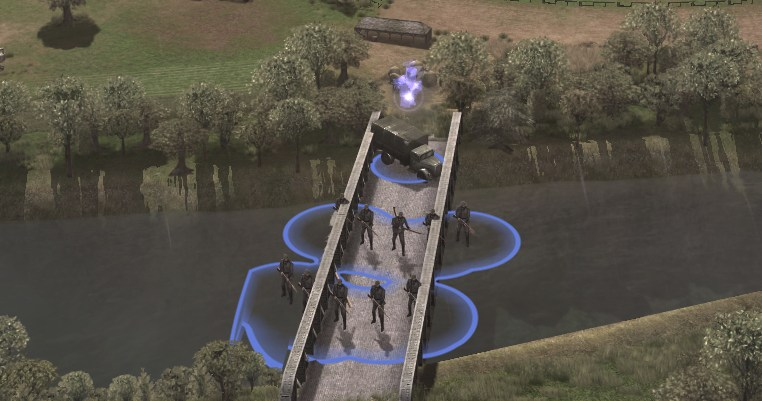<br>
      <sub><b>Bridges units cross.</b> Where your road meets water, the build puts the map's own kind of bridge.</sub>
    </td>
    <td width="33%" valign="top">
      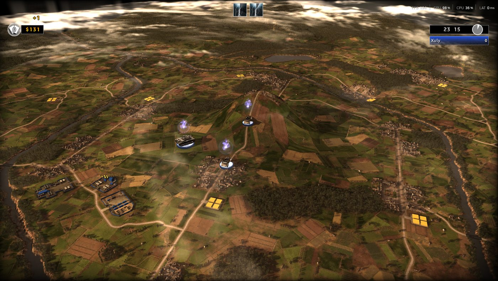<br>
      <sub><b>Ground you shape.</b> Hills, craters, lakes and dried rivers that units drive and fight on.</sub>
    </td>
    <td width="33%" valign="top">
      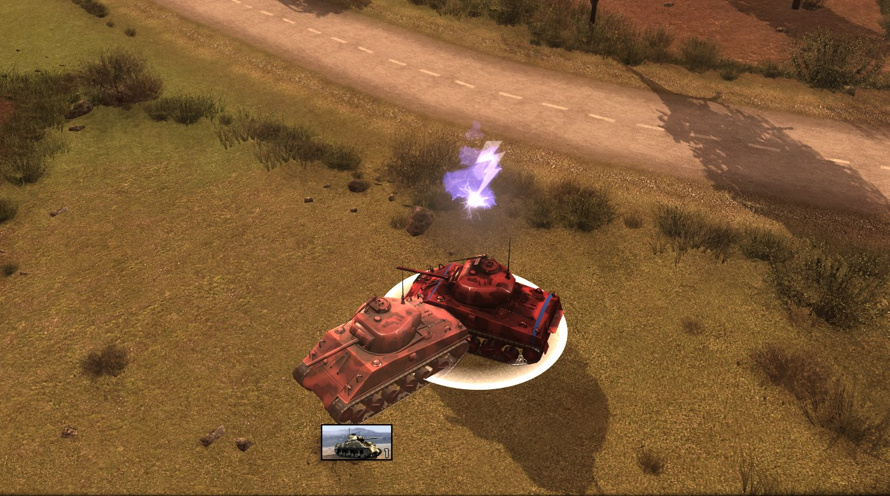<br>
      <sub><b>Units with their own look.</b> Repaint any unit in Blender and bring it back.</sub>
    </td>
  </tr>
</table>

## Inside the Studio

<table>
  <tr>
    <td width="50%" valign="top">
      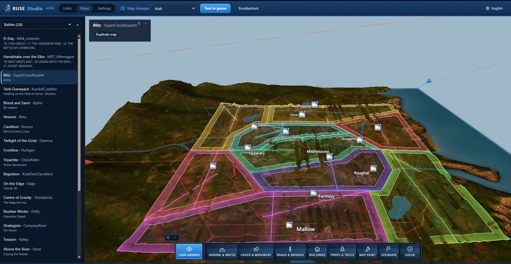<br>
      <sub><b>Every map in 3D.</b> Blitz with its zones and towns; the tools run along the bottom.</sub>
    </td>
    <td width="50%" valign="top">
      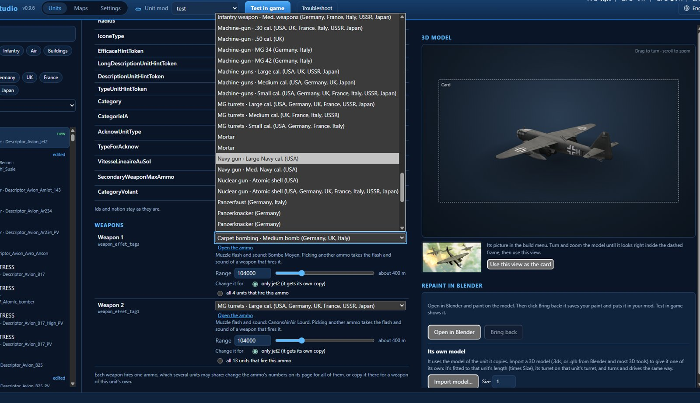<br>
      <sub><b>Units.</b> Change a unit's weapons and numbers, see it in 3D, make its card, repaint it in Blender or give
      it a model of its own.</sub>
    </td>
  </tr>
  <tr>
    <td width="50%" valign="top">
      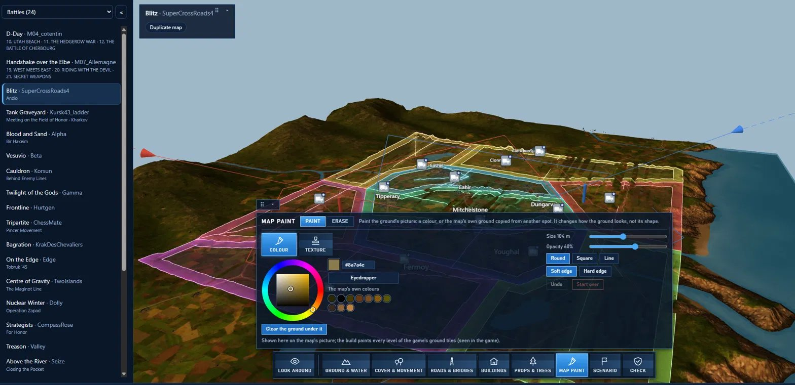<br>
      <sub><b>Map Paint.</b> Paint the ground's picture with a colour, or with the map's own ground from another
      spot.</sub>
    </td>
    <td width="50%" valign="top">
      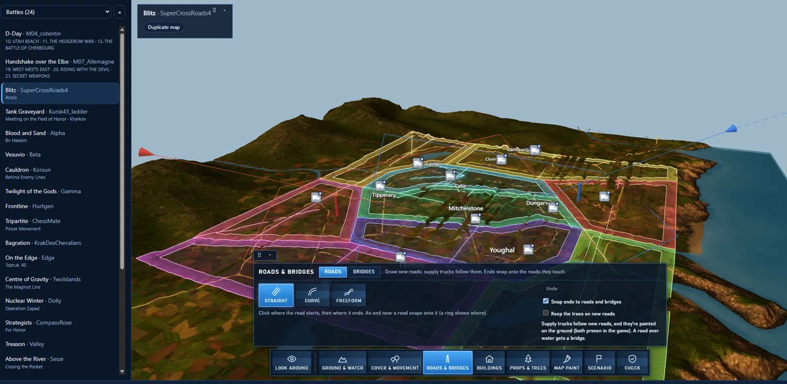<br>
      <sub><b>Roads and bridges.</b> Straight, curved or freehand; supply trucks follow them, and a road over water gets
      a bridge.</sub>
    </td>
  </tr>
  <tr>
    <td width="50%" valign="top">
      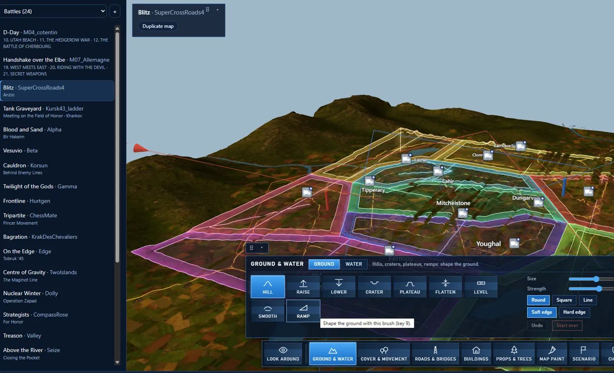<br>
      <sub><b>Ground and water.</b> Hills, craters, plateaus, flattened ground and ramps, round or square, soft or
      hard edged.</sub>
    </td>
    <td width="50%" valign="top">
      <br>
      <sub><b>Any map the game lists.</b> D-Day in the map view, with its towns, zones and starting points.</sub>
    </td>
  </tr>
</table>

**About the name:** R.U.S.E. 2.0 is a placeholder. Before the full version (1.0) comes out, we'll consult Eugen
Systems, the makers of R.U.S.E., and the project will take a name they're okay with. Name ideas and constructive
criticism are welcome in [the name discussion](https://github.com/sneadtristen6/R.U.S.E-2.0-Project/discussions/18).

## What you can do

<table>
  <tr>
    <td width="33%" valign="top">
      <br>
      <sub>A hill raised with brushes. Units drive up it.</sub>
    </td>
    <td width="33%" valign="top">
      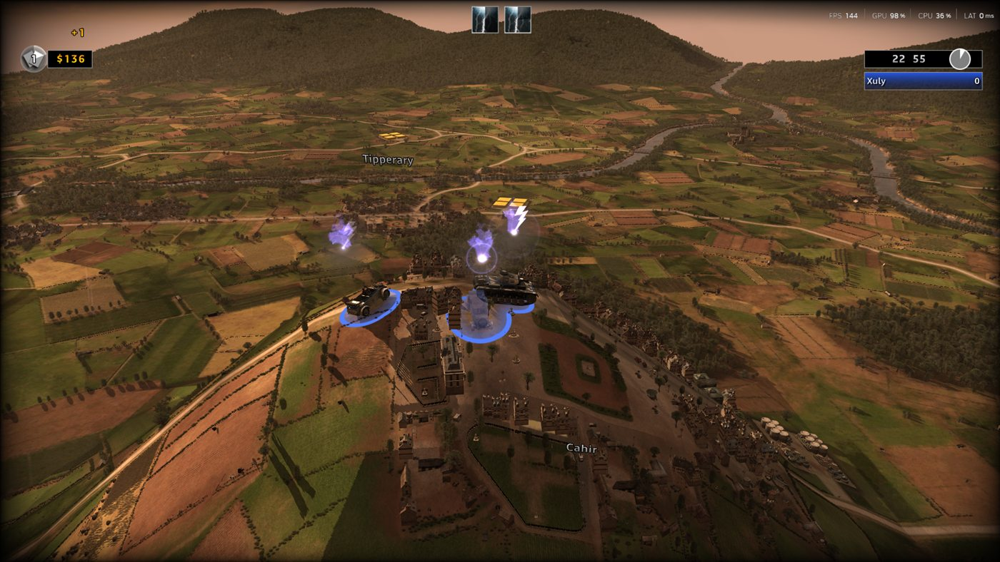<br>
      <sub>The town and its trees rise with the ground.</sub>
    </td>
    <td width="33%" valign="top">
      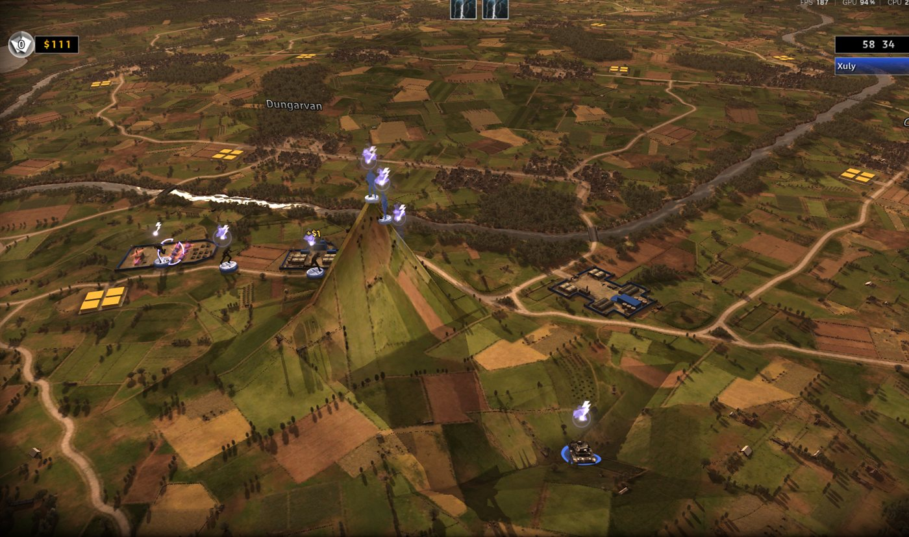<br>
      <sub>Painted cover. Infantry on it are hidden.</sub>
    </td>
  </tr>
  <tr>
    <td width="33%" valign="top">
      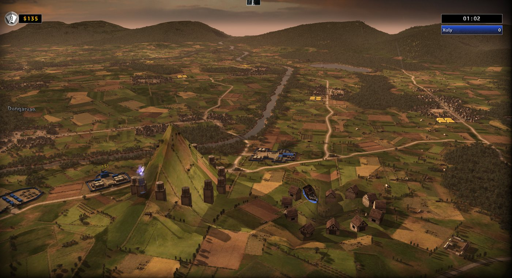<br>
      <sub>Buildings placed by a mod, up to 8x size.</sub>
    </td>
    <td width="33%" valign="top">
      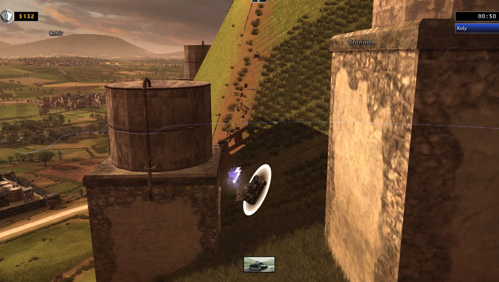<br>
      <sub>Placed buildings are solid. Tanks go around.</sub>
    </td>
    <td width="33%" valign="top">
      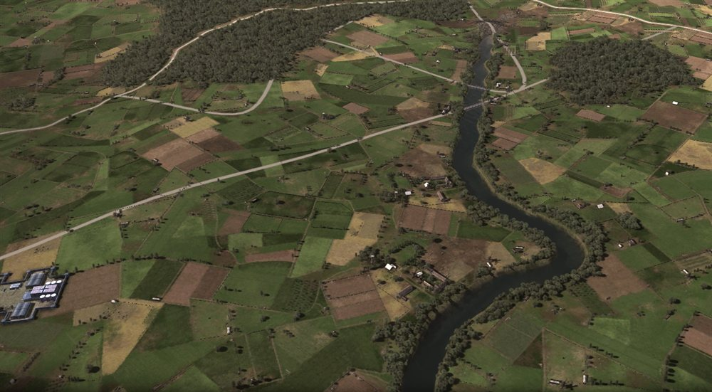<br>
      <sub>Roads drawn in the Studio, bridges over water.</sub>
    </td>
  </tr>
  <tr>
    <td width="33%" valign="top">
      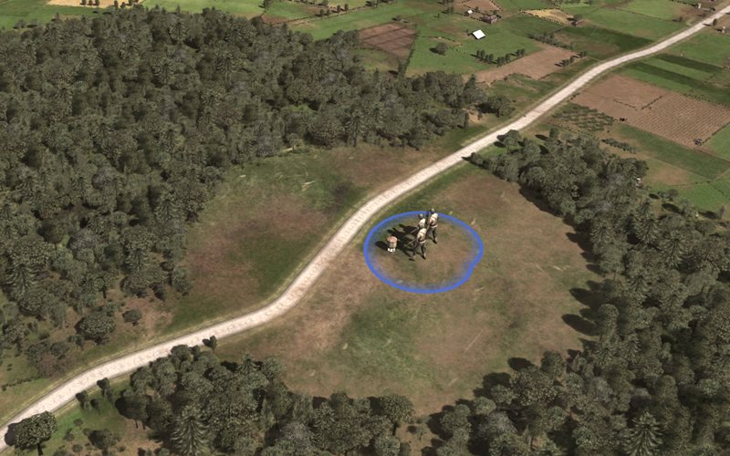<br>
      <sub>A wood cleared by a mod. Tanks drive in, infantry aren't hidden there.</sub>
    </td>
    <td width="33%" valign="top">
      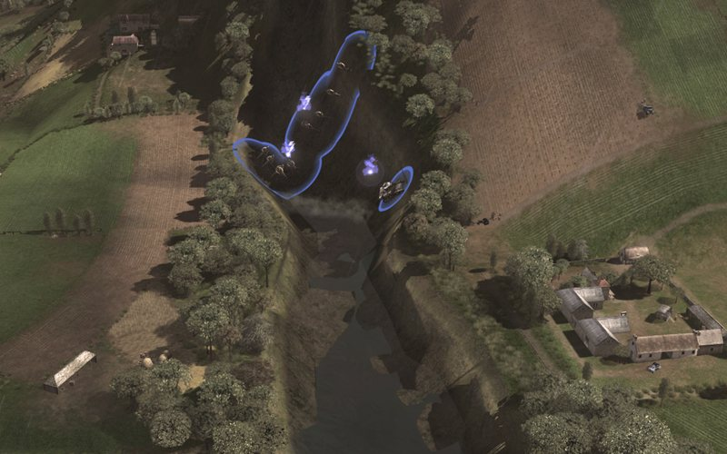<br>
      <sub>A river drained by a mod. Units walk its bed.</sub>
    </td>
    <td width="33%" valign="top">
      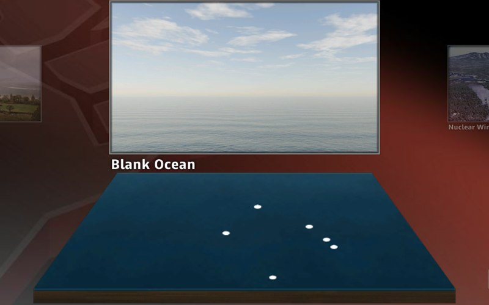<br>
      <sub>A new map started blank, with its own menu pictures.</sub>
    </td>
  </tr>
</table>

| For players | For modders |
|---|---|
| Pick a mod set and press Play | Change any unit's numbers, then test in game |
| Drop mod files on the window to add them | Make new units |
| Run community mods as they are | Shape the ground with brushes |
| Share a load order with a friend | Draw roads with bridges over water |
| New versions install themselves | Place buildings, cover, and starting points |
| Tick mods from our supported list | Clear the map's own woods and props |
| Troubleshoot finds what stops Play, and fixes it | Check a map before you test it |
| Play new maps that start blank | Start a new map as flat land or open sea, with its own menu pictures |
| Hear a mod's own songs | Replace songs and voice lines in the Music tab |
| Play a nation with a new name and flag | Make one of the game's nations into another |

<details>
<summary><b>Everything the apps can do</b></summary>

A modding platform for R.U.S.E. Its aim, step by step: new units, maps, models, missions and one-click modded
multiplayer (today: units, and the first map tools). The content goals on top are RUSE 2.0 and Pacific Island
Defense.

**Your Steam install is never changed.** Mods are built into a separate modded copy of the game (hard links to the
game's packs, plus the packs a mod rebuilds), and Play starts that copy.

<p align="center">
  
  <br>
  <sub>RUSE Studio's Maps view: every map the game ships, in 3D, with its real ground, water and towns. Here, D-Day
  with its battle's zones and starting points, and the map tools along the bottom.</sub>
</p>

**Players, with RUSE Launcher**

- Pick a mod set and press **Play**: the launcher builds a modded copy of the game and starts it.
- Add a mod file (a `.rusemod` from the Studio, a community `.rmod` used as it is, or a `.zip`), or drop it on the
  window.
- Make and reorder mod sets in the window.
- Share a mod set's load order with a friend, or import one. It's the same text RUSE-Mod-Manager copies and reads,
  so load orders go both ways.
- **Supported mods:** tick mods from our list and they're downloaded and checked; cheat mods are kept apart and
  never ticked for you (Launcher 0.3.0).
- **Troubleshoot** checks in one go what can stop **Play** and fixes what it can, and a **clean game backup** puts
  back game files another mod manager changed (Launcher 0.3.0, Studio 0.8.0).
- Get new versions without downloading by hand: the launcher offers them, checks the file and installs it (from
  0.2.0 on).
- **Mod sets** and the **Mod library** in two tabs, each with the window's whole height: the whole library in reach,
  with a search and a count (Launcher 0.3.1).
- **Convert an old mod…** (Launcher 0.4.8.1, LittleGroove's Convert brought over): an older mod that comes as the
  game's own packs, made to be copied into the game folder, becomes a mod your library plays beside others (not tried
  with a real old mod yet). When two mods change the same game file, the Launcher says so before Play, and **Use the
  one from…** picks which.

**Modders, with RUSE Studio**

- Browse every unit and building by its code name or in any of the game's ten languages.
- Change a unit's numbers in your own mod, with Undo, then **Test in game**.
- See every map in 3D with its real ground, listed by the name players know (in any of the ten languages) next to
  its code name, with the game's own 3D models of its buildings and trees.
- Make new units, and give a weapon another unit's ammo (its muzzle flash and sound come with it). A new unit can go
  in any nation's build menu: a German Tiger or a Japanese Zero for the US works in any match (2026-10-02, Studio 0.8.1).
- Shape a map's ground with brushes (hills, craters, ramps, level, lakes) that **work in the game**: units drive on
  it and take orders there (checked on Blitz, 2026-09-30).
- **Make towns and woods units hide in:** the map view shows where units hide (in green), and the Cover, Uncover and
  Town brushes paint it (Town: click a town, cover goes around all its buildings). Infantry on painted cover are
  hidden in the game (2026-09-30).
- See each map's scenarios, grouped as the game uses them (skirmish, Operations, campaign): zones, starting points,
  spawns and town names. **Move** starting points and spawns, and **add units and buildings** a scenario starts with
  (pick the kind, the type, the unit and its side).
- Place buildings, props and trees, up to 10× their size, and export a mod as one file. Placed buildings show in the
  game (2026-09-30, Studio 0.6.9).
- **Say where units can go:** the map view shows it (red: no unit, yellow: infantry only), the Block brushes close
  ground to every unit, to infantry or to vehicles, and placed buildings stop units (Solid). Proven in the game
  (2026-09-30, Studio 0.7.0).
- The map tools sit in a bar along the bottom, Cities: Skylines style (Studio 0.7.0), grouped since 0.8.1: Ground &
  water, Cover & movement, Roads & bridges, Buildings, Props & trees, Erase, Scenario and Check, a tab for each tool
  in a group.
- **Draw roads**, Cities: Skylines style (straight, curved, freeform; ends snap onto roads; their length shown as
  you draw): supply routes use them, they're painted on the ground, and a road over water gets a bridge units drive
  across, all in the game (2026-09-30, Studio 0.7.2 to 0.7.6). Tanks, infantry and supply trucks cross a new
  bridge on its deck, and infantry follow new roads (2026-10-01, Studio 0.8.0).
- **Clear woods and props** with the **Erase** tool (Studio 0.8.1; `[[erase]]` in scenery.toml): units drive into a
  cleared wood and infantry there are no longer hidden; a **Bridges dock** places a bridge by hand; **Check this map** lists what would go wrong before you
  test; Open and Forest brushes (2026-10-01, Studio 0.8.0).
- **More players on a map, up to 8:** a Players count and an Add starting point tool (D-Day as a 4v4; built, the
  in-game check is next).
- **Start a new map blank** (Studio 0.9.8): **Duplicate map** starts it as **Blank Terrain** (flat land with nothing
  on it but the starting points) or **Blank Ocean** (the sea over the whole map). Under them: **take out** the map's
  own roads, bridges, depots, units and names, **sectors over the whole map**, and a thin layer of **water over the
  whole map**. **Menu pictures…** gives any map its own pictures in the game's menus, from a PNG of yours or made in
  Blender from the map's own 3D model, with the start dots where its players start. Seen in the game (2026-10-05).
  Since 0.9.8.1, Blank Terrain's ground is made from your terrain strokes (seen in the game on test maps), and Blank
  Ocean carries a warning: separate islands aren't ready for full-scale battles, so join the islands with land or an
  underwater road.
- **LittleGroove's tools** (Studio 0.9.8.1), from his RUSE-Mod-Manager: an **Economy** tab (starting money and
  income, supply depots, the ruse cards each side starts with), an **AI** tab (how the computer players play, the
  units they prefer and their ruse cards, and the game's map and mission scripts, shown read only), an **Upgrade box**
  on a unit's page, **All values** (add or take out a value, make or delete an object), a **Files** tab (see a file
  of the game's packs, save it out, or change it in your mod), and the missions' scripts, checks and menu order. Seen
  in the game: the starting money and cards, and the AI tab.
- **A Music tab** (Studio 0.9.8.1): every song by where it plays, each replaced in a small editor in the Studio (cut,
  fade, volume), new songs added to the battle lists, a unit's voice lines on its page, and a map's background sound.
  Seen in the game: the songs, the new songs and the voice lines.
- **Make a nation into another** (Studio 0.9.8.1): the **Nations** tab gives one of the game's seven nations a new
  name, in the lobby and for its army, and a new flag from any picture: China in Italy's place, say. Seen in the
  game: the new name in the lobby, the new flag beside the player's name in a match.
- **Units from other eras** (Studio 0.9.8.1): the Units tab gets the eras WWI, WWII+, Cold War and Modern beside the
  game's own units. They have no units yet: those come in a later update, with models other people made and shared
  for free, each maker credited.
- **Add units in formations:** 1 to 10 at once, in a line, column, wedge, box or circle (Studio 0.7.1).
- A **mod check** reads every file of your mod the way the game build does, names each problem and offers the fix
  (set a broken file aside, rename a map folder to the map's pack name) (Studio 0.7.1).
- **Help at hand:** both apps open the wiki, Discussions and a ready-filled bug report (Studio 0.7.1, Launcher
  0.2.7).
- Units, buildings and ammunition sorted by type (factories, money, forts, decoys; AP, HE, anti-aircraft...).
- A Settings tab (keys, game folder, updates), kept through updates. The Studio offers its own new versions.
- The language is a button at the top of both apps, and the first start opens "Choose your language": each of the
  ten languages in its own words, with the one R.U.S.E. is set to in Steam (else the PC's) marked.

Modders who write mods by hand can also use the `ruse` command-line tool, from the source (see
[For contributors](#for-contributors) below).

<table>
  <tr>
    <td width="50%" valign="top">
      <br>
      <sub>RUSE Launcher: pick a mod set and press Play. It builds a separate modded copy of the game; your Steam
      game stays as it is.</sub>
    </td>
    <td width="50%" valign="top">
      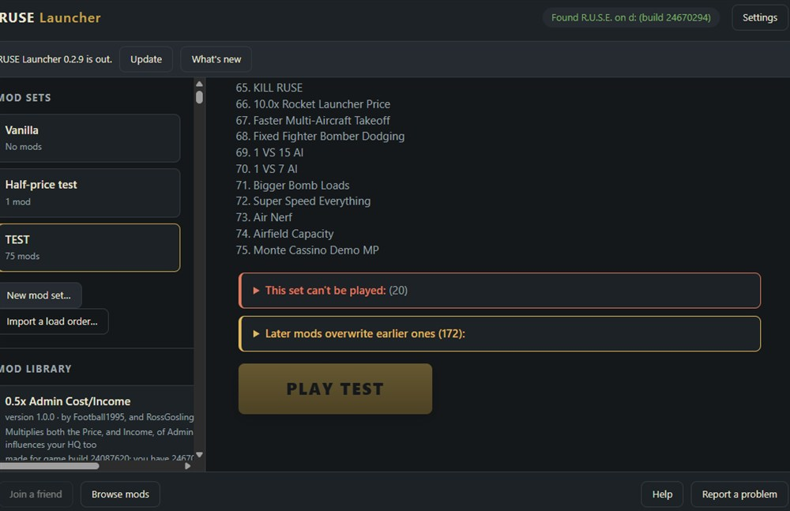<br>
      <sub>A set of 75 community mods: the launcher says which can't go together, and which overwrite which.</sub>
    </td>
  </tr>
  <tr>
    <td width="50%" valign="top">
      <br>
      <sub>RUSE Studio: a unit's values, flags and price, ready to edit.</sub>
    </td>
    <td width="50%" valign="top">
      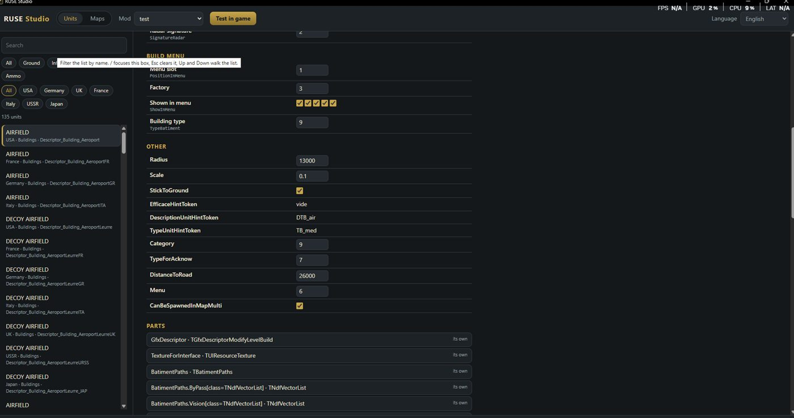<br>
      <sub>RUSE Studio: the unit list, with filters by type and nation.</sub>
    </td>
  </tr>
</table>

**Map making, in the game, in more detail:**

- Blitz, in the game: a hill raised with the Studio's brushes. Units drive up it and take orders on it, and the
  player's HQ starts at a place the mod moved it to.
- On top of the hill: the town of Cahir and its trees rise with the ground (2026-09-30). The recipe is
  DomesticNukes and his Claude's.
- Cover painted on open ground (here on a test hill): the infantry standing on it are hidden, as in a wood. That's
  how new towns and woods hide units.
- Buildings placed by a mod: water towers at 8× their size ring the hill, barns at 6× ring a pit next to it
  (2026-09-30).
- Movement, later the same day: placed buildings are solid (the tank threads between the towers), and a pit is
  blocked for every unit. The map's own movement data is read and written now.
- D-Day: roads drawn in the Studio, painted into the ground, and a bridge where each crosses the river: the map's own
  kind, one piece stretched bank to bank as the game's own are (2026-09-30).

<table>
  <tr>
    <td width="50%" valign="top">
      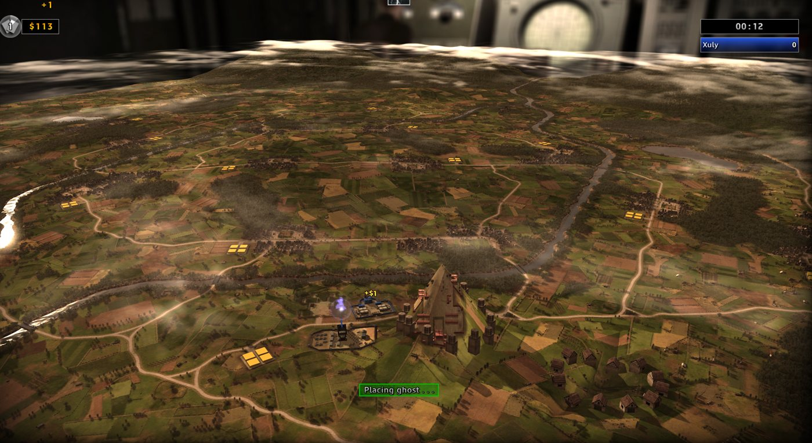<br>
      <sub>Building on the edited ground in the game works too. Four crashes on the way were fixed the same
      evening.</sub>
    </td>
    <td width="50%" valign="top">
      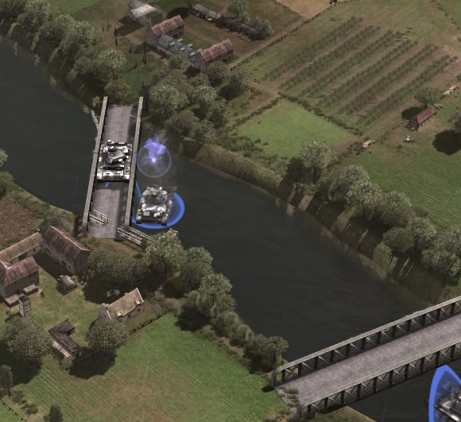<br>
      <sub>Tanks crossing on a new bridge. Each gets the floor of a shipped bridge of its kind, so units drive on the
      deck, not the riverbed under it (2026-09-30).</sub>
    </td>
  </tr>
  <tr>
    <td width="50%" valign="top">
      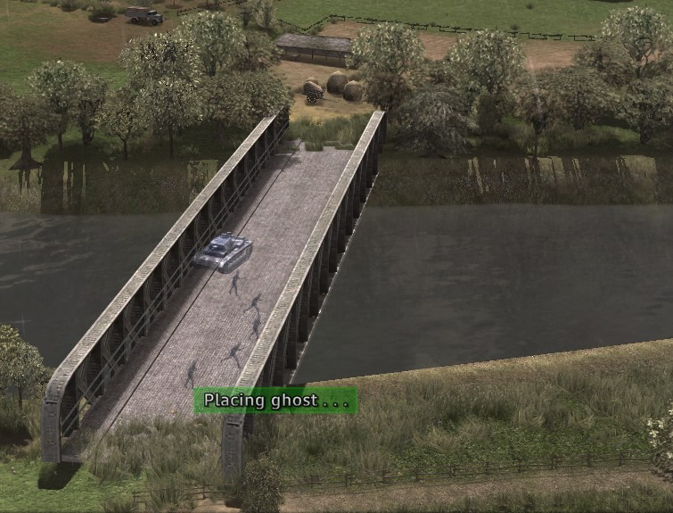<br>
      <sub>A road drawn in the Studio meets the river, the build puts the map's own kind of bridge across it, and units
      take it: a tank and a squad on the deck (D-Day, in the game, 2026-10-01).</sub>
    </td>
    <td width="50%" valign="top">
      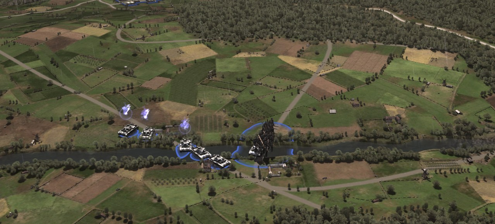<br>
      <sub>A tank column on its way over.</sub>
    </td>
  </tr>
</table>

**The bridge night (2026-10-01).** One night, twelve hours, six rounds of building a bridge and testing it in the
game. Five rounds changed where units may *walk*. What settled it was working out how the game places a unit: its
position comes from the map's movement circles, its height from the floor under it, and nothing ties the two. An
infantry squad is five men spread 11 m wide, each standing on whatever floor is under his own feet. The game's metal
bridges carry invisible floor 47 to 66 m out over the river beside the deck; ours had the deck alone, so the men
beside it stood on the riverbed. New bridges now get floor 12 m out each side, over water only, in the deck's own
plane. On the way: decks joined to the roads units already use, never through a farmyard; a mod's buildings no
longer open the water beside the map's own bridges; the floor file keeps the game's own rules (men stopped lying
sideways). The movement-map reading is shared with DomesticNukes and his Claude.

</details>

## Install in three steps

1. **Download** the installer from [Releases](https://github.com/sneadtristen6/R.U.S.E-2.0-Project/releases):
   `RUSE-Launcher-Setup-<version>.exe` for players, `RUSE-Studio-Setup-<version>.exe` for modders. Windows only. You
   need R.U.S.E. in your Steam library, installed.
2. **Run it.** No admin rights and no Python needed. The installers are not code-signed yet, so Windows may warn once
   ("Windows protected your PC"): click **More info**, then **Run anyway**. Your browser may also warn about a new
   download. To check you have the real file, compare its SHA-256 with the one in the release notes.
3. **Start it** from the Start menu. It finds R.U.S.E. through Steam. In the launcher, pick a mod set and press
   **Play**. In the Studio, build the game index once when it asks (about a minute), then pick or make a mod.

Uninstalling keeps your mods and settings. The apps need Microsoft Edge WebView2, which Windows 11 has; if a PC
doesn't, the app says so. The Studio's 3D map view needs the internet the first time it opens (it loads its 3D
library from the web). To try what is merged but not released yet: the repo's **Actions** tab, the latest **apps**
run, **Artifacts** (needs a GitHub login; the files expire after 90 days). More in
[installers/README.md](installers/README.md), including what to do about browser warnings.

Stuck on something? See [Questions? Ask any AI](#questions-ask-any-ai) at the bottom of this page.

## How we got here

The big steps so far, newest first. Each one was played in the game before it went out.

<details>
<summary><b>LittleGroove's tools, music, and a nation made into another (Studio 0.9.8.1)</b></summary>

LittleGroove's RUSE-Mod-Manager had tools ours didn't. They're in the Studio now: the **Economy** tab (starting money,
income, supply depots and starting ruse cards), the **AI** tab (how the computer players play, and the game's map and
mission scripts to read), the **Upgrade box**, **All values**, the **Files** tab, and the missions' scripts, checks and
menu order. The starting money and cards and the AI tab were seen in the game; the rest isn't tried there yet.

The **Music** tab lists every song by where it plays. Replace one in a small editor (cut, fade, volume), add new songs
to the battle lists, change a unit's voice lines on its page, or give a map its own background sound. The songs, the
new songs and the voice lines were heard in the game.

The **Nations** tab makes one of the game's seven nations into another: China in Italy's place, with its name in the
lobby and for its army, and a flag made from any picture. Seen in the game: "China" in the lobby's list, and its flag
beside the player's name in a match. The lobby's own flag button still shows the game's flag.

Blank Terrain's ground is now made from the terrain strokes, not the game map's ground pushed about: round shores up
close and from high up, no dents in hilltops, buildings and tanks sitting right on it. Seen in the game on test maps.

**Why there are no navy maps yet.** We tried maps of islands for full-scale battles with ships, and the game itself
stands in the way: a land unit sent to an island it can't reach crashes the game; joining the islands with a strip of
land stops the crash, but then the computer just sends its infantry across it; with no road between the islands, no
building can be placed anywhere; and with the game's own weapons, ships and land units can barely hurt each other.
Map data alone can't fix the crash, so navy maps wait. Blank Ocean stays in the Studio, with that warning on it.

</details>

<details>
<summary><b>New maps start blank, with their own menu pictures (Studio 0.9.8)</b></summary>

A new map no longer has to start as a full copy of a game map. **Duplicate map** can start it as **Blank Terrain**,
flat land with nothing on it but the starting points, or as **Blank Ocean**, the sea over the whole map. The tools
under them work on any map: take out the map's own roads, bridges, depots, units and names, let its sectors cover the
whole map so all of it can be taken, and lay a thin layer of water over all of it.

And every map can have its own pictures in the game's menus: a PNG of yours, or a picture made in Blender from the
map's own 3D model, with the white start dots drawn where its players start. Seen in the game on BATTLES > Blank
Ocean, Blank Terrain, and a copy of D-Day with pictures made in Blender beside the game's own D-Day.

Fixed on the way, each seen in the game: a unit built on a drained sea crashed the game, old river water stood as
walls along a map's edge, and erased lighthouses still shone over the sea. Not tried yet: units under Blank Ocean's
water.

</details>

<details>
<summary><b>Very large map mods now build in minutes (Studio 0.9.7)</b></summary>

The most extreme map mod we have drains the whole sea off BATTLES > D-Day: 154 flatten strokes, 135 paint strokes
and 33,385 buildings erased. Its first build took about four hours. Now it builds in **under 10 minutes**, with the
same game files as before: every step was checked byte for byte against the old one on that map. It took us roughly
15 hours.

Where it was stuck, and why:

- **One cause for three problems.** The build opens dried ground to units in zones, and it made them 15 m wide, the
  size that suits a river. A drained sea is a quarter of a million of those: more than a map's movement can hold, so
  the build was refused as too big, or ran for hours, or used up 14 GB of memory and stopped the PC. A wide dried bed
  now gets zones as big as it has room for.
- **Where units can go, worked out in parallel.** Infantry and vehicles each have their own movement, and nothing ties
  the two, so they're worked out on two cores at once, while the ground is being painted. Their heaviest sums now run
  on whole grids at once instead of point by point.
- **Painting the ground.** That mod's paint strokes reach about 2,500 of the ground's picture tiles, and each tile was
  worked out pixel by pixel. Now a run of strokes of one colour is worked out at once, a tile painted over completely
  forgets what was under it, the tiles are shared across the PC's cores, and painted tiles are kept between builds:
  an unchanged map repaints in half a second.
- **Mending riverbeds.** A dried riverbed's banks get painted over from both sides. That used to search the whole
  map; now it looks only where the old water was, on whole grids, across the cores.
- **The rest.** Reshaping the ground went from over three minutes to about 25 s, erasing most of a map's scenery from
  about four minutes to seconds, and the check that warns when an open takes in water from 34 s to 7.5 s.

Everything the build works out is kept between builds, so a rebuild after a small change takes a fraction of the first
one. And the Studio's **Export mod…** puts what the build worked out for a map's movement into the mod, so a player's
first build of it is shorter. Not tried in the game yet: units on a drained sea. And navy maps aren't worked out yet:
a drained or painted sea builds and loads, but the water still shows. We're still working on making it faster.

</details>

<details>
<summary><b>Import your own models: an M1 Abrams in R.U.S.E. (Studio 0.9.6)</b></summary>

RUSE Studio can now give a new unit a 3D model of its own, from Blender or any 3D tool. On the new unit's page, pick a
**.3ds** or **.glb** with **Import model…**: the Studio fits it to the unit it copies (its size, its turret on that
unit's turret, its pictures as textures of its own) and the game drives and turns it like the original. How:
[Import a model](https://github.com/sneadtristen6/R.U.S.E-2.0-Project/wiki/Import-a-Model).

**The first model brought into R.U.S.E. from another 3D program:** an M1 Abrams, a new US tank beside the Sherman.
Seen in the game: bought at the Armor Base with its own card, built, turning its turret. Get it as a mod in
[Ruse-Mods](https://github.com/sneadtristen6/Ruse-Mods) (model: "Tank Abrams" by ags, free at
[downloadfree3d.com](https://downloadfree3d.com/3d-models/vehicles/tank/tank-abrams/)). Early: its tracks and wheels
don't turn yet.

<table>
  <tr>
    <td width="50%" valign="top">
      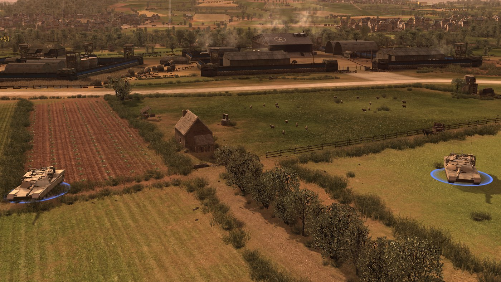<br>
      <sub>Two M1 Abrams at the base: a model from another 3D program, in the game.</sub>
    </td>
    <td width="50%" valign="top">
      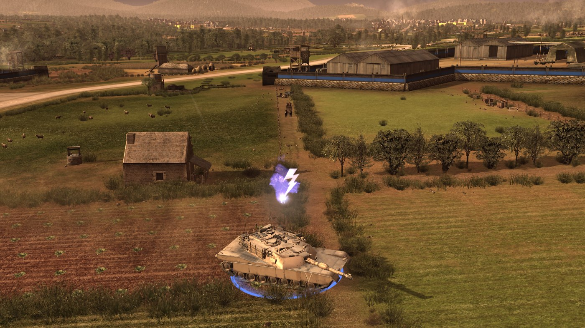<br>
      <sub>Just built, with its own card in the Armor Base menu.</sub>
    </td>
  </tr>
</table>

Also in 0.9.6: **Test in game** (and the Launcher's **Play**) start at once when nothing changed, builds reuse what
they made last time, **Delete map** for the maps you make, and **Erase the whole map**.

</details>

<details>
<summary><b>Units get their own look, and our first new unit (Studio 0.9.5)</b></summary>

See any unit in 3D on its page in RUSE Studio, repaint it in Blender, and make its card in the build menu from the
3D view. Our firsts, all seen in the game:

- **The first unit repainted by a mod:** a red Sherman, up close and from far.
- **The first unit painted in Blender** and brought back into the game.
- **The first build-menu card made in the Studio,** in the game's own Armor Base menu.
- **The first new unit with a 3D model of its own,** beside the game's: the Tall Sherman, next to the Sherman. Made in
  testing; making your own models in the Studio came in 0.9.6 (above).
- **The first mission of our own** played to a victory: a new Operation with its own goals, units and an artillery
  strike. Made in testing.

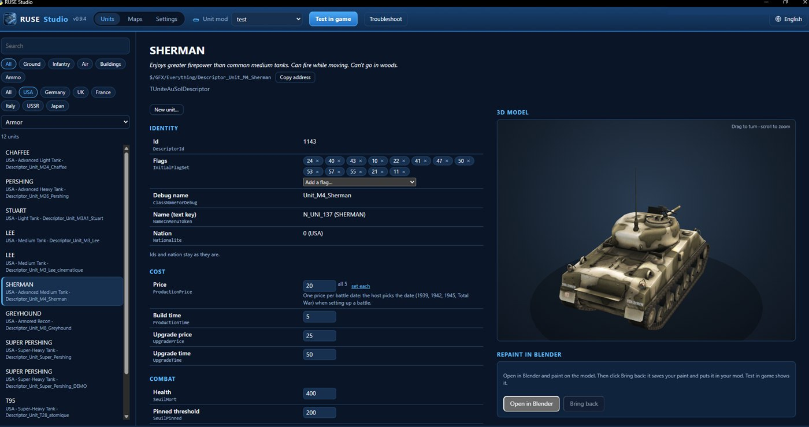

<table>
  <tr>
    <td width="50%" valign="top">
      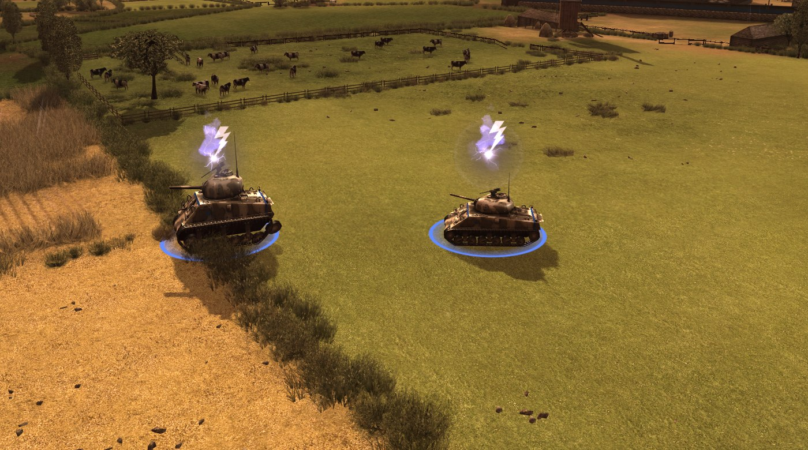<br>
      <sub>Two Shermans: the game's, and a new unit with a model of its own.</sub>
    </td>
    <td width="50%" valign="top">
      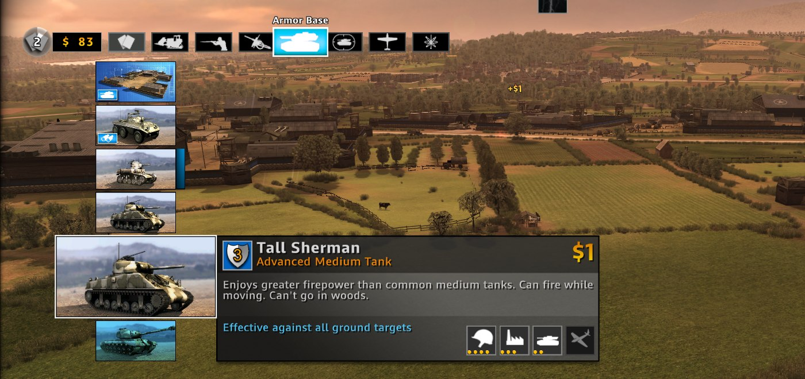<br>
      <sub>The new unit in the Armor Base's build menu.</sub>
    </td>
  </tr>
  <tr>
    <td width="50%" valign="top">
      <br>
      <sub>Repainted by a mod.</sub>
    </td>
    <td width="50%" valign="top">
      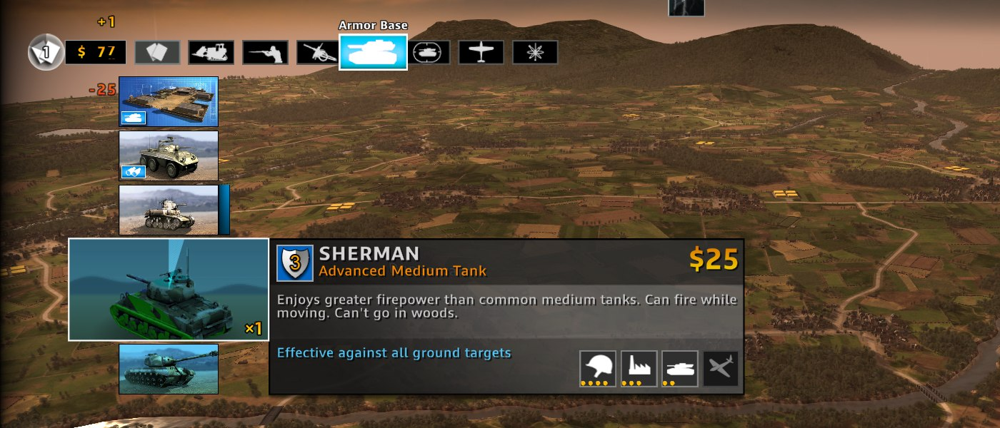<br>
      <sub>A card made from the Studio's 3D view, in the game's build menu.</sub>
    </td>
  </tr>
</table>

</details>

<details>
<summary><b>Roads that look like the map's own (Studio 0.9)</b></summary>

A road you draw in RUSE Studio now looks like the map's own roads, from high up and right down at the ground: the
map's own asphalt with its dashed centre line, gravel shoulders fading into the grass, nothing growing through it.
Tested in the game on D-Day.

<table>
  <tr>
    <th width="50%">Before</th>
    <th width="50%">After</th>
  </tr>
  <tr>
    <td width="50%" valign="top">
      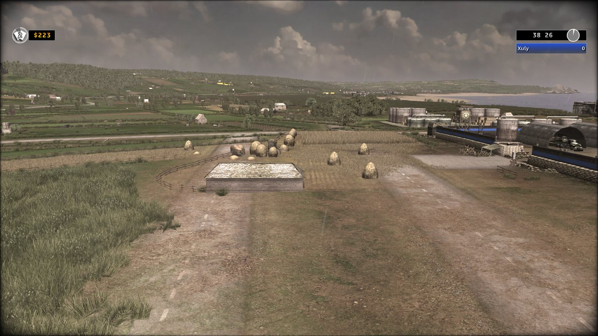
    </td>
    <td width="50%" valign="top">
      
    </td>
  </tr>
</table>

It took a lot of time and a lot of tests, longer than the bridges.

</details>

<details>
<summary><b>Bridges work. Map making starts here.</b></summary>

Reshape any R.U.S.E. map. Hills, towns, roads, and bridges your units actually cross. Draw a road in RUSE Studio.
Where it meets water, the build puts the map's own kind of bridge across it, and tanks, infantry, and supply trucks
cross on the deck. Roads and bridges are what new maps get built on, so this is the piece everything else stands on.

<p align="center">
  
  <br>
  <sub>Infantry and a supply truck crossing a new bridge at deck height, in the game.</sub>
</p>

<table>
  <tr>
    <th width="50%">Before</th>
    <th width="50%">After</th>
  </tr>
  <tr>
    <td width="50%" valign="top">
      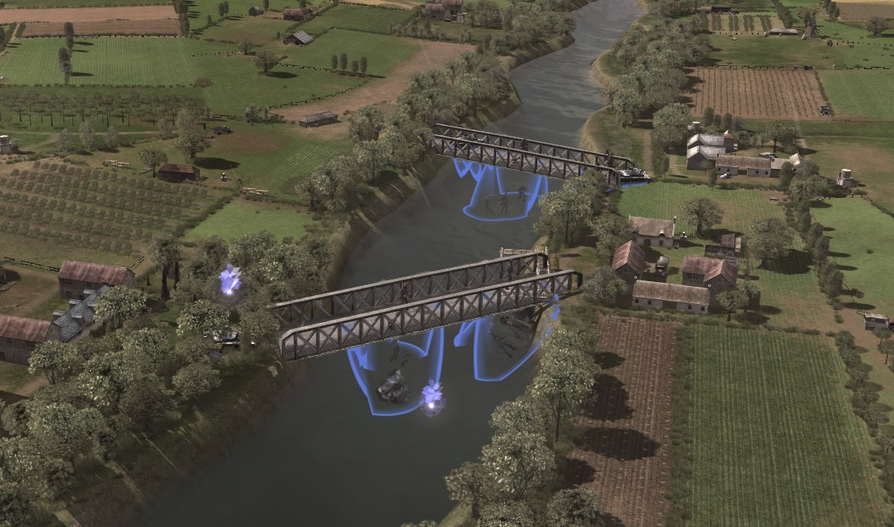
    </td>
    <td width="50%" valign="top">
      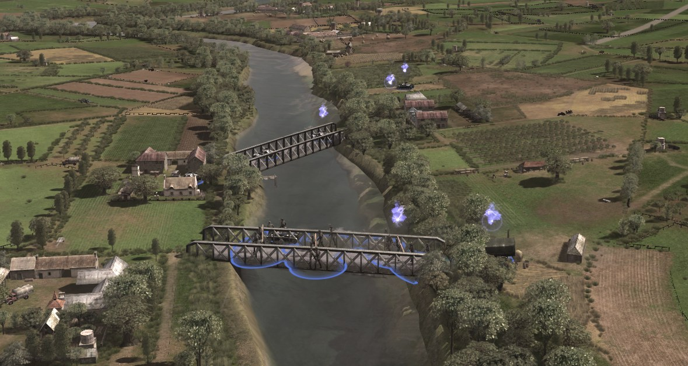
    </td>
  </tr>
</table>

Twelve hours, six rounds of testing.

</details>

<details>
<summary><b>Status</b></summary>

[](https://github.com/sneadtristen6/R.U.S.E-2.0-Project/releases?q=launcher)
[](https://github.com/sneadtristen6/R.U.S.E-2.0-Project/releases?q=studio)
[](https://github.com/sneadtristen6/R.U.S.E-2.0-Project/actions/workflows/tests.yml)
[](LICENSE)

**Launcher** for players (latest: 0.4.8.1) &middot; **Studio** for modders, a preview (latest: 0.9.8.1) &middot; Windows &middot; needs R.U.S.E. on Steam

Early, and moving fast. **Proven in the game:** value and text mods, new names in all ten languages, new units that
are built and fight, maps with their own pack, terrain texture tiles we write ourselves, a first `.rmod` check
(two community mods in one modded copy), and on 2026-09-30: terrain brushes (hills, pits, level
ground that units drive on and take orders on), a moved starting point, painted cover that hides infantry, placed
buildings (at up to 8× their size), and both apps updating themselves; on 2026-10-01, roads with new bridges
that tanks, infantry and supply trucks cross, infantry following new roads, a bridge placed by hand, a building at
10× standing on the ground, a dried riverbed units walk, and a cleared wood tanks drive into and infantry no longer
hide in; on 2026-10-03 and 04, units repainted by a mod and in Blender, a build-menu card made in the Studio, a
second Sherman with a 3D model of its own, a mission of our own played to a victory, a new Operation, another nation's
units in a campaign map, erased buildings opening their ground, a new unit's own card, and an M1 Abrams imported from
another 3D program; on 2026-10-05, a drained sea units are built and move on, new maps that start blank (Blank
Terrain, Blank Ocean) with sectors over the whole map, and a map's own pictures in the game's menus, made in Blender
or from a PNG, with the start dots where its players start; by 2026-10-08, the Economy tab's starting money and cards,
the AI tab, replaced and new songs and voice lines, a nation with a new name in the lobby and a new flag in a match,
and Blank Terrain's own ground. **Not yet checked in the game:** a new unit made in the Studio's window, mod sets made
in the launcher's window, a mod exported as one file, sharing a load order, units a skirmish spawns, Browse mods, and
from 0.9.8.1 the Upgrade box, All values, Files, the missions' tools and background sounds.

</details>

<details>
<summary><b>Docs</b></summary>

**[Field manual (wiki)](https://github.com/sneadtristen6/R.U.S.E-2.0-Project/wiki)** &middot;
**[Discussions](https://github.com/sneadtristen6/R.U.S.E-2.0-Project/discussions)**: questions, ideas, bug reports and
mods to show &middot; **[Discord](https://discord.gg/DbufY4Jfg)**: talk with the community and the makers &middot;
**[Contributing](CONTRIBUTING.md)** &middot; **[Code of conduct](CODE_OF_CONDUCT.md)**

| Doc | What it covers |
|---|---|
| [docs/MOD_FORMAT.md](docs/MOD_FORMAT.md) | draft spec of the mod package format |
| [docs/ANNOUNCEMENTS.md](docs/ANNOUNCEMENTS.md) | what we post to the community, newest first |

</details>

<a name="for-contributors"></a>
<details>
<summary><b>For contributors</b></summary>

How to report bugs, test in the game and send code: [CONTRIBUTING.md](CONTRIBUTING.md).

<details>
<summary><b>The two apps from source, and the installers</b></summary>

The two apps run on the engine, separate from each other (neither needs the other). Both are
desktop windows built like web pages; once: `py -3 -m pip install pywebview`. Their screens also open in a normal
browser with made-up data: `src/ruse_launcher/ui/index.html?fake`, `src/ruse_studio/ui/index.html?fake`.

- **RUSE Launcher** ([`src/ruse_launcher/`](src/ruse_launcher/)), for players: it finds the game,
  lists your mod sets and has a big Play button that builds the set's modded copy and starts the game (Vanilla
  starts through Steam). `py -3 -m ruse_launcher`. **Players never touch a file.** A
  mod library ("Add a mod file…" for a `.rusemod` from the Studio, a `.rmod` or a `.zip`, or drop a mod file or
  folder on the window; each mod is checked first), mod sets made on screen (new, edit and reorder, rename,
  duplicate, delete), Share and "Import a load order…" for a mod set (RUSE-Mod-Manager's own text, so load orders
  go both ways; [`src/rusemod/loadorder.py`](src/rusemod/loadorder.py)), a three-step guide on Vanilla ("Playing
  with mods, in three steps"), and the launcher in the PC's own language (any of the game's ten). **Supported
  mods** (0.3.0): our list of mods (a GitHub repository, MOD_FORMAT §15) with tick boxes, several installed at once,
  each file checked against the list before it goes into the library, cheat mods kept apart; offline, the last
  copy of the list.
- **RUSE Studio** ([`src/ruse_studio/`](src/ruse_studio/)), for modders: browse every unit and
  building, see a unit's values, parts and what uses it, and pick a language: the game's own names by default, or
  any of the game's ten languages. Pick or make a mod and change a unit's numbers right on its page: each change is
  saved in the mod's `src/studio.rndf` (with Undo); a part several units share changes for one of them or all.
  "Test in game" builds the mod and starts the game. **Maps** (released in 0.4): every map the game lists, in 3D
  with its real ground mesh and ground textures (decoded once per map and kept). **Also:**
  - **"Export mod…"** turns the mod into one file, `<id>-<version>.rusemod`, with the game build and the mod's
    fingerprint inside, for the launcher's "Add a mod file…" (the loop from modder to player).
  - **New unit…** on a unit's page makes a copy with its own name (one name, shown in all ten languages), price and
    build menu (the same nation and factory, or another nation's); it's listed as new, edited like any other unit,
    and can be deleted.
  - **In Maps:** each map's buildings and a share of its props and trees. Pick a brush and click or drag on the
    ground to shape it: each stroke is drawn at once and saved in the mod's `maps/<map>/terrain.toml`; a ramp takes
    two clicks (its start, its end), Undo takes a stroke back, Start over clears the map. "Place on the map" lists
    the map's own types (most used first, with a search); set Turn and Size, click the ground, and the object is
    saved in the mod's `maps/<map>/scenery.toml`. "Test in game" builds it all into the map.

  `py -3 -m ruse_studio` (after `ruse index build`); `--spike` opens the 3D check.
- `py -3 -m pip install -e .[apps]` once gives two commands, `ruse-launcher` and `ruse-studio`, that open them
  without a console window.
- **Installers** ([`installers/`](installers/README.md)): GitHub builds `RUSE-Launcher-Setup-<version>.exe` and
  `RUSE-Studio-Setup-<version>.exe` on every push that changes the apps (Actions, **apps**, Artifacts). A tag
  `launcher-v<version>` or `studio-v<version>` publishes one as a Release. No Python or Git needed, no admin rights.
  Not signed yet, so Windows warns once ("More info", then "Run anyway").

</details>

</details>

<details>
<summary><b>Tools and checks</b></summary>

- [`tools/check_public.py`](tools/check_public.py): run by GitHub on every push; fails if private material, game
  files or details of the game's program would reach this public repo.
- [`tools/rmod_to_mod.py`](tools/rmod_to_mod.py): rebuilds a RUSE-Mod-Manager `.rmod` as a mod of ours.

</details>

<details>
<summary><b>Running the tests</b></summary>

[`tests/`](tests) holds tests on small made-up files; no game needed:

```
py -3 -m unittest discover -s tests
```

(with `PYTHONPATH=src`). GitHub runs them on every push, on Windows and Linux
([`.github/workflows/tests.yml`](.github/workflows/tests.yml)).

</details>

## Credits

R.U.S.E. 2.0 stands on three people's work. None of it would be here without them.

### ProLution: the godfather of R.U.S.E. modding

- Built the **RUSE Modding Database** and wrote the guides people learned from, custom Operations among them.
- **ProLution's code is in ours:** the map terrain codec in
  [`src/ruse_mod_engine/terrain_codec.py`](src/ruse_mod_engine/terrain_codec.py) is built on ProLution's terrain
  format work (released CC0), and its encoder is ported from ProLution's reference encoder.

### LittleGroove: the first

- **LittleGroove was the first to give R.U.S.E. a real mod manager:** RUSE-Mod-Manager and its `.rmod` format.
  Every community mod in the Launcher works because of it.
- **LittleGroove's engine is in ours,** used as it is: [`src/ruse_mod_engine`](src/ruse_mod_engine/) applies
  `.rmod` mods in every build, and moves a mod made for another game build with LittleGroove's version maps. It's
  why the whole program is GPL-3.0.
- **LittleGroove's map editor led the way for ours:** supply depots and HQs sticking to roads (LittleGroove's
  measured distances), the opening camera each match starts on, and turning it round the HQ all come from that work.
  So does saving a changed scenario so the game loads it, and the units editor's ammo types and flag lists.
- **LittleGroove's tools are in the Studio and the Launcher** (Studio 0.9.8.1, Launcher 0.4.8.1): the Economy and AI
  tabs, the script viewer, the Upgrade box, All values, the game's files, the missions' tools, and Convert an old mod
  all come from his RUSE-Mod-Manager.

### DomesticNukes: the map maker's groundwork

- **DomesticNukes laid the map maker's groundwork:** the ground units walk on, where every building, tree and prop
  stands, and the recipe the terrain brushes follow so a reshaped map loads and plays.
- **DomesticNukes wrote the water brushes:** lakes and drained rivers, merged from DomesticNukes' own pull request.
- **DomesticNukes' work on the game's models** put the game's real 3D models in the Studio's map view, and helped
  make units from another nation work.
- The notes on unit flags, bridge floors and how units stand on the ground went into the build's checks and the
  bridges units now drive over. DomesticNukes tests the releases in the game, too.

### sneadtristen6 and Claude: building R.U.S.E. 2.0

**sneadtristen6 is the mind behind R.U.S.E. 2.0.** The ideas are his, he decides what it becomes, and he plays
every change in the game before it goes out. **Claude**, Anthropic's AI, helps shape his ideas into plans and writes
the code. Side by side since September 2026, in its first weeks they got the game to do this:

- **New maps.** On 3 October 2026 R.U.S.E. got new maps: listed in BATTLES beside the game's own, each playing its
  own ground. To find the limit, 101 went in at once; all of them showed and played. As far as we know, they're the
  first new maps the game has had since D-Day.
- **A map editor that works in the game:** ground that units drive and fight on, lakes and dried rivers, roads that
  look like the map's own from high up and right down at the ground, bridges that tanks, infantry and supply trucks
  cross, buildings, props and trees that show at every distance, cover, and where units can go.
- **Units:** change any of them, make new ones, and give a nation another army's tanks and planes.
- **Two apps in the game's ten languages,** the Studio for modders and the Launcher for players, that never touch
  the game's own folder.

It's early, and there's much more to come. Thank you to the three above, without whom none of it would have started.

### (Anonyme) Oozaru: testing and debugging

**(Anonyme) Oozaru tested the early apps on his own campaign mod and sent the log with every bug he found.** His
reports led to these fixes:

- Placed props that showed only up close are now drawn out to the far distance (Studio 0.9.3).
- His units for the player in a campaign chapter never appeared; they can now be given to the player.
- His French units on Holland crashed the game while loading; another nation's units now load in campaign chapters
  and Operations too (0.9.5).
- He mapped which of Italy chapter 1's IR names is which side: the US player, France, Italy, the UK and the US
  computer.
- His "waiting 30 minutes every time just to add or remove a unit" is why **Play** now starts at once when nothing
  changed (Launcher 0.4.6).

Thanks also to everyone who has tried the apps, sent screenshots and reported bugs.

### Supporter credits

Supporter names are added here after the supporter chooses a public credit name.

#### Monumental Supporters

A prominent, personal thank-you for $100 supporters helping lay the foundation for R.U.S.E. 2.0 and the vision
of Pacific Defense, with Iwo Jima as its flagship map, and China. This group appears first in the supporter credits.

#### Above & Beyond Supporters

A thank-you and name credit for $20 supporters who go above and beyond to help keep development moving.

## Support development

R.U.S.E. 2.0 is my first modding project. If you want to support development and follow the behind-the-scenes work,
[visit my Patreon](https://www.patreon.com/SneadTristen6). Any support helps me keep building.

### One-time support options

| Option | Amount | Recognition |
| --- | --- | --- |
| [Above & Beyond Supporter](https://www.patreon.com/SneadTristen6/posts/171328212) | $20 once | Your chosen name in the Above & Beyond Supporters section of the GitHub and mod credits. |
| [Monumental Supporter](https://www.patreon.com/SneadTristen6/posts/monumental-100-171328695) | $100 once | A prominent acknowledgment in the Monumental Supporters section, with a dedicated thank-you for helping lay the foundation for the project's vision. |

I've always envisioned **Iwo Jima as the flagship map for a Pacific Defense DLC-style expansion**, alongside
adding **China** to the game. Support helps me work toward that dream. These are development goals for this
independent fan project.

Credit is optional: after purchasing, send a Patreon message with your chosen public name and permission to
publish it, or choose to remain anonymous. Credits are updated with project releases. These Shop purchases do
not renew automatically.

You can also [request a feature for a one-time $3](https://www.patreon.com/SneadTristen6/posts/request-r-u-s-e-171321812).

## Questions? Ask any AI

Everything here is written down in plain words, so any AI assistant (ChatGPT, Claude, Gemini...) can answer from it.
Give it the link to **[ai/START-HERE.md](ai/START-HERE.md)**, the page written for AI assistants (where every answer
lives, the apps' words, what's tested), or to this page, and ask what you want to know:

- *"How do I give the US a German Tiger with RUSE Studio?"*
- *"How do I draw a road with a bridge across a river?"*
- *"My test in game stopped with an error. What does it mean?"*
- *"What does a mod's scenario.toml file do?"*

The best page to point it at: [docs/MOD_FORMAT.md](docs/MOD_FORMAT.md) (everything a mod can do, file by file).
Still stuck? Open an [issue](https://github.com/sneadtristen6/R.U.S.E-2.0-Project/issues).

## License

GNU General Public License, version 3 ([LICENSE](LICENSE), GPL-3.0): copyright (C) 2026 sneadtristen6 and the
RUSE Mod Platform contributors. The apps ship [`src/ruse_mod_engine`](src/ruse_mod_engine/), LittleGroove's
RUSE-Mod-Manager engine (GPLv3), used as it is (see Credits), and its license needs the whole program under
GPL-3.0 (it was MIT until 2026-09-30). `src/ruse_mod_engine/python251` carries
Python's license ([its LICENSE.txt](src/ruse_mod_engine/python251/LICENSE.txt)). This is an independent, fan-made
tool, not affiliated with or endorsed by Eugen Systems. R.U.S.E. and its game data belong to their owners; this
project ships no game files and works only on a copy of a game you own.
