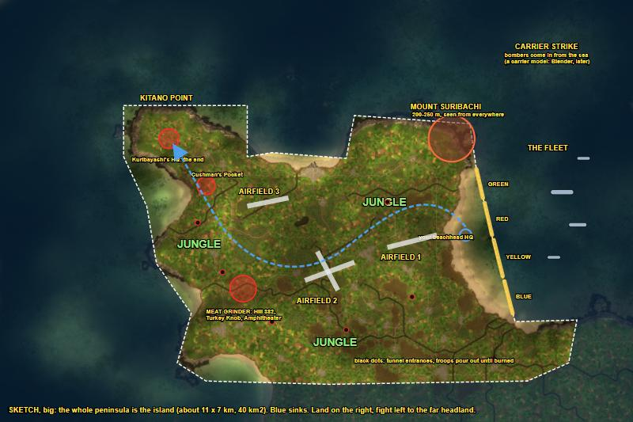
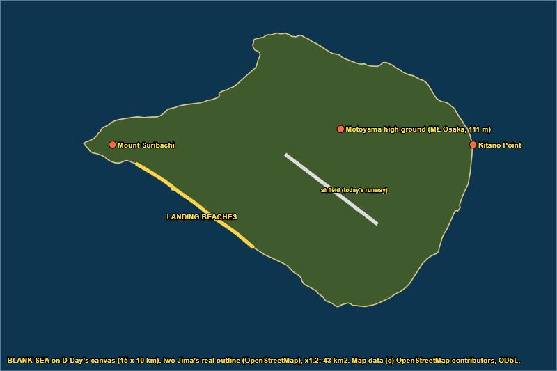

# Iwo Jima: the showcase Operation (draft template, 2026-10-03)

The owner's flagship map (README: "Iwo Jima as the flagship map for a Pacific Defense DLC-style expansion"), and the
showcase for the platform's videos. This page is a **draft for the owner**: what the island and its Operation could
look like, built from what the game and our tools already do. Nothing here is decided. Every piece says whether it was
**seen in the game**, **built but not tried**, or **still to build**.

The owner's wishes so far (2026-10-03): "I really want the mountain to be like very clear"; "along the way, there to
be like the infamous bunkers that would have to be flamethrowered out"; "tunnels ... some sort of like building or
like quote unquote tunnel that like comes out of the trees, and they just like rush out of the ground"; and, for the
map in general (not this page's job): garrison orders, trenches, beach landings. Then: "it's too small ... I want it to
be big. I want it to feel like I have to work through the jungle and manage my units correctly in order to win. And
like I'm fighting just waves of ... Japanese that are just wanting to protect their country and their emperor ... like
it terrified those GIs. I want to capture that feeling"; "I like the idea of the fleet shelling", "maybe like a bombing
run from an aircraft carrier" (a carrier model: the Blender work, later).

**So the template goes for the feeling, not the survey:** an island far bigger than life, dressed as jungle (the real
Iwo Jima was bare volcanic sand and scrub; jungle is the owner's call for the fight he wants), crossed on foot against
wave after wave.

## 1. The battle, in the beats a mission can play

From the battle's history (Wikipedia, "Battle of Iwo Jima"):
- **The island:** about 21 km², flat and bare except **Mount Suribachi** (161 m), a volcanic cone at the southern
  tip, joined to the rest by a narrow neck. The north is the higher **Motoyama plateau**. Three airfields: No. 1 in the
  south, No. 2 in the middle, No. 3 (unfinished) in the north. Black volcanic sand on the beaches.
- **The landing (19 February 1945):** the Marines came ashore on the south-east beaches, **Green and Red** (5th
  Division, nearest Suribachi) and **Yellow and Blue** (4th Division), after three days of naval bombardment.
- **The defence:** General Kuribayashi's 21,000 men in about 18 km of tunnels linking bunkers and pillboxes. No defence
  on the beaches: the Japanese let the Marines land, then opened fire.
- **Suribachi:** cut off on the first day, taken on 23 February; the flag raising.
- **The Meat Grinder:** Hill 382, Turkey Knob and the Amphitheater on the plateau; Cushman's Pocket (Bloody Gorge) in
  the north-west; the last stand near **Kitano Point**, the northern tip.
- **Flamethrower Shermans** ("Zippos") burned out bunkers from D+2 on.
- **Banzai:** a 1,000-man night charge on 8 March and a last 300-man attack near Airfield No. 2 on 25 March.

## 2. The map

**Size: as big as the game goes.** The biggest map the game has is D-Day (`M04_cotentin`, 15 x 10 km); a bigger
one would have to be built from nothing (PLAN §13, level 3). All 32 shipped maps were measured (2026-10-03): no map has
an island in open sea, and only D-Day has wide open sea, on three sides.

**The island: about 40 km², nearly twice the real Iwo Jima**, about 11 x 7 km, with sea all round, on D-Day's 15 x 10
km canvas. How the fight runs across it (the big sketch below shows the flow; the island's final outline is Iwo
Jima's own, see "It must not look like D-Day"):
- **The landing** goes onto a long beach (about 4 km: Green, Red, Yellow, Blue), facing the open sea where the fleet
  sits; your beachhead HQ just behind it.
- **Mount Suribachi** rises at the beach's end: the first thing you see from the boats, and the first big objective.
- **The jungle** fills the island: you fight your way through it, past the three airfields and the Meat Grinder, to
  the far headland, **Kitano Point**, where Kuribayashi's HQ is the end: about 8 km on foot from the beach.

 *(the flow, drawn on D-Day's peninsula: blue
sinks, dashed is the coast, black dots are tunnel entrances, the blue arrow is the push. Superseded for the shape: the
peninsula would still read as D-Day)*

Earlier sketches: life-size on D-Day's top block (`images/iwo-jima-sketch.jpg`, "too small"), then the whole
peninsula (above: big enough, but recognisably D-Day).

**The jungle floor.** The jungle's cover is painted where the trees stand so infantry hide in it (the cover brush:
seen in the game); the ground is painted dark (Map Paint: seen from high up; up close it's being worked on, T20/T21).

**Mount Suribachi, very clear:** a steep cone about 1.2 km across, taller than life (200-250 m) so it stands out from
the whole map, with a crater on top (the terrain brushes: hill, crater, plateau, smooth, all seen in the game), bare of
trees, ringed with pillboxes on its slopes.
- **The ceiling:** the build keeps every height inside the map's own height range. What counts is the room above the
  sea:

  | Map | Height range | Its sea, up the range | Room above the sea |
  |---|---|---|---|
  | D-Day | 180 m | 49 m | **132 m** |
  | Swamps | 205 m | 27 m | **178 m** |

  So on D-Day's canvas at D-Day's own sea level, a life-size Suribachi (about 170 m) **doesn't fit**. There are two
  ways round it:
  - **A lower sea.** The blank sea floods the whole map anyway, so the new sea can sit low in the range: at about
    12 m up, with the sea bed under it, there's about 168 m of room. T30's bay was 10 m deep and read as sea. A whole
    map's sea at a level of our own is **to test**.
  - **A higher ceiling.** The build would raise the map's height range first. That's not built, and not tried in
    the game.

  "Taller than life" needs the second one.
- **T30's lesson:** its test cone, 66 m tall and about 400 m across, read as no mountain at all ("there's no, like,
  mountain or anything"). Suribachi has to be built at full size.

### It must not look like D-Day

The owner (2026-10-03): "as long as that doesn't look like ... the exact D-Day map, I don't want to be able to load in
and be like, oh, this is D-Day ... we might have to add a new tree, a jungle tree ... we really gotta be thinking about
this."

**The owner's go (2026-10-03): the blank sea** ("for now, the blank sea is okay. Later on, we can worry about adding
textures and waves so it at least looks better"), with the real coastline downloaded. Iwo Jima's outline from
OpenStreetMap: today's island is **30 km², 8.8 x 6.2 km** (volcanic uplift has grown it since 1945's 21 km²),
Suribachi 170 m. Scaled 1.2 times onto D-Day's canvas: **43 km², 10.6 x 7.4 km**, sea all round (about 2.3 km at each
end, 1.8 km in front of the landing beaches for the fleet, 0.9 km behind), the landing beaches running from Suribachi
along the coast as in 1945:

(Map data © OpenStreetMap contributors, ODbL: a mod built from this outline credits it so.)

The reasoning: **keep nothing of D-Day but its size.** D-Day is only the biggest canvas the game has. On it, a
**blank sea**: the whole map sunk under the ocean, then the island raised out of it in Iwo Jima's own shape (the real
coastline, scaled up to about 40 km²), so no Normandy coast, river, road, field or town is left to recognise. This is
the "blank maps" work already on the plan (PLAN §13: flat, one texture, empty scenery, fresh movement), with sea
instead of flat ground. What makes a map recognisable, and how each goes:

| What gives D-Day away | On Iwo Jima | How | Status |
|---|---|---|---|
| The coastline (the peninsula's shape on the map table) | Iwo Jima's own outline, bigger | Everything sunk, the island raised | raising out of water **seen**; new sea **to test** |
| The relief: flat land, river valleys | Suribachi, the plateau, ridges and gorges (the Meat Grinder), no rivers | Terrain brushes | **seen** |
| Fields, hedgerows, orchards, towns, churches | Jungle, scrub, Japanese positions | The island starts with no scenery, then jungle placed | erase **seen**; an empty scenery file **to build** (blank maps) |
| The road network | A few jungle tracks of our own | No old roads; new ones drawn | new roads **seen**; a map without its own roads **to build** (other sessions) |
| The patchwork ground | Black sand beaches, dark jungle floor, bare rock on Suribachi | Map Paint on the island's ground | from high up **seen**; up close **being fixed** (T20/T21) |
| Town names on the map | Iwo Jima's places (Motoyama, Kitano Point...) or none | The scenario's name labels | scenario edits **seen** |
| Normandy's grey light, sky, sea colour, birds and cows | Hot sun, tropical sea, jungle sounds | Another theatre's light, sky, water and ambient sound in the copy | **to try** |
| The minimap and the menu picture | Pictures of the new island | Drawn from the new ground | **to build** (a new map's own menu picture is on the list) |
| How units move | Over the new island only | Fresh movement made for the raised land | dried ground opened **seen** (a riverbed); a whole island **to build** |

### The jungle tree

The owner is right that the jungle needs its own trees. What there is, cheapest first:
1. **D-Day's own dense woods**, darkest kinds only: seen in the game, but they're European trees.
2. **The game's palms** (Africa set: several palms, cut palms, fallen leaves), mixed into the woods: whether a France
   map can carry the Africa set's trees is **to test**.
3. **A real jungle tree of our own**: modelled in Blender, then brought into the game. Two pieces, neither built yet:
   a model back from Blender into the game's model packs (PLAN M7; today models go out to Blender, not back), and a
   new kind of scenery object the map can place (today we place the game's own kinds). This is the biggest piece of
   the look, and the one thing here only new work can give.

## 3. The Operation, phase by phase

Built with the mission blocks the game's own missions use (45 shipped missions read, 169 kinds of block; T22 proved
our own mission plays, T30 the fleet, bombers, pillboxes and waves). Marked: **[seen]** in the game in our tests,
**[game]** used by Eugen's own missions but not tried by us, **[new]** to build.

| Phase | What the player sees | How |
|---|---|---|
| 0. Bombardment | The fleet offshore shells the island; smoke and fire on the beaches and Suribachi | The Battleship, Cruisers and Destroyers stand on the sea as scenario units and shell named spots, as Eugen's Salerno landing (Italy chapter 1) does **[seen]** (T30: on the water, the battleships firing); the artillery strike order **[seen]** |
| ...the carrier strike | Bombers come in low from the sea and hit the island | Bombers made by the mission out over the sea and sent on a bombing run **[seen]** (T30); stand-ins (B-25s, P-47s) until the Blender work brings a carrier and Navy planes **[new]** |
| 1. The landing | Waves of Marines and Shermans land on Green, Red, Yellow and Blue; LCVPs at the waterline; the island is quiet... | Units brought in by the mission at the beach spots, wave after wave **[seen]**; LCVPs and LSTs as units on the water **[seen]** (T30), LCVP props on the sand (D-Day's France set) **[game]** |
| ...then it opens fire | Once enough Marines are ashore, every bunker opens up | The defenders hold fire until a count of US units is on the beach (hold fire **[game]**, count in a zone **[seen]**) |
| 2. Cut off Suribachi | Goal: push across the neck behind the headland, so Suribachi's garrison is on its own | Zone goal **[seen]** |
| 3. Suribachi | Goal: burn out the pillboxes on its slopes, then reach the summit; the flag raising | Pillboxes made by the mission (by their building name), burned out by Crocodiles, goal done when the group is gone **[seen]** (T30); summit zone **[seen]**; the camera turns to the summit, a popup, music **[game]**; a flag: no flag model found in the game, **[new]** |
| 4. The airfields | Goals: take Airfield No. 1, then No. 2; counter-attacks | Zone goals **[seen]**, attacks ordered by the mission **[seen]** (T30) |
| 5. The Meat Grinder | Hill 382, Turkey Knob, the Amphitheater: bunkers, and Japanese troops pouring out of tunnels in the trees | **Tunnels** (the owner's idea): a tunnel mouth in a notch cut into the slope (the buried pillbox now, a model of our own later); when US units come near, Japanese infantry appear at it and charge, again and again **while the entrance stands**: burn it to seal the tunnel. Units appear and charge, a second wave, zone trigger **[seen]** (T30); "while it stands" (a repeat that stops when the entrance is gone) and ambushes **[game]**; the exit apart from the trigger (T30's lesson) |
| 6. Kitano Point | The banzai charge; Kuribayashi's headquarters | A mass attack of Japanese elite infantry ordered by the mission **[game]**; goal: destroy his HQ, then **VICTORY** **[seen]** |
| Defeat | Time runs out, or the beachhead is lost | The Operation's countdown **[seen]** |
| Bonus goals | Raise the flag inside N minutes; no Sherman lost; every tunnel sealed | Bonus goals **[seen]** (T22's first goal showed as a bonus one); the goal label's style decides main (0, 12) or bonus (1, 23) |

**The jungle and the waves (the feeling the owner wants).** The whole push from the beach to Kitano Point is through
jungle, against an enemy that keeps coming:
- **Waves:** the mission sends Japanese infantry at the US lines again and again, bigger as you go inland, from the
  jungle and from tunnel entrances (units made and sent to attack by the mission, a second wave after the first
  **[seen]**, T30); the Japanese side also played by the computer for the whole map (as Fortress Europa does) **[game]**,
  its aggressiveness set by the mission **[game]**.
- **Banzai charges:** at set moments (a goal taken, a timer), a mass of Japanese elite infantry charges a US position
  **[game]**.
- **Unseen enemies:** snipers (the game's Japanese Sogekihei sharpshooters) and infantry hidden in the jungle's cover;
  ambushes when you walk into a zone (the ambush order **[game]**).
- **The fear:** the game's stress on units (pinned, panicking under fire) raised by the mission where it should hurt
  **[game]**; radio-style popups from the front **[seen]**; music that changes with the fight **[game]**.
- **Managing your units:** infantry lead in the jungle (woods hide infantry: seen in the game; how much they slow or
  stop tanks: to see), flame for bunkers, artillery and the fleet called on positions you've found.

**The two sides.** US: G.I.s and Rangers (no Marines unit: a renamed copy is a data change), Shermans, the
**Crocodile** flamethrower tank, Priests, Long Toms, the fleet. Japan: Konoe and Teishin Shudan infantry, the
**pillbox** ("very resistant bunker"), 105 mm positions, AA positions, Chi-Ha and Chi-Nu tanks, Type 88 75 mm guns,
Kuribayashi's HQ. Pillboxes that only flame really hurts: a balance change in the Units tab, to try.

## 4. What it rests on, and the tests

Seen in the game: a new Operation (T17); our own mission in its own folder, texts, goals, popups, units, an artillery
strike, victory (T22); ground raised over water, the edge, a hill (T15b, T18); a dried bed walked; scenery placed and
erased; roads and bridges. From T30: new sea sunk where land was (it "looked kind of like the sea"); the game's fleet
on the water, shelling; bombers made over the sea and sent in; Japan's units and the US ships in one Operation (two
model packs together); pillboxes made by the mission and burned out; Japanese waves made at a spot, charging.

Not yet known, each one game test:
1. **New sea, up close and at scale**: T30's bay read as sea from the player's view; units kept off it, and the whole
   map sunk (the blank sea), aren't seen yet.
1b. **Land raised out of the sea, walked on**: raised ground over water is seen; units on a raised sea bed only on a
   riverbed so far, and a raised bed looked torn up close (T18). T30's causeway wasn't reported.
1c. **A whole map's sea at a level of our own**: needed for a life-size Suribachi on D-Day's canvas (the ceiling,
   section 2).
3. **An Operation on D-Day's ground**: the game has none there. Prolution's Fortress Europa made one from D-Day's
   first chapter; our Duplicate map would need "make it an Operation".
4. **Japan in a European map's Operation**: a mission's sides can be any nation (T30 had Japan's pack loaded on
   Swamps, Gold for the Brave's own map); whether D-Day's map loads Japan's buildings and HQ.
5. **The flag on Suribachi**: no flag model found; options: a building that flies one, a new model later.
6. **Palms on another theatre's map**: the Africa set's palms placed on a European map.
8. **Another theatre's light, sky, sea colour and sounds** in a copied map.
9. **No goals panel at the start**: our missions no longer open it (it showed as an empty black box); the next mission
   test shows the box is gone.

### What the Operation waits on

The owner (2026-10-04): no need to keep building the Operation while the scripting is in place; the models come first,
and they take a while. Where each piece stands:

| Piece | Ready | Waits on |
|---|---|---|
| **The mission** | Every kind of block the phases use is seen or in Eugen's missions; the build refuses unit types the game can't make | Writing the Operation's own mission (today our test missions are written by a private test script; the real one should be written from a readable plan of its phases) |
| **The map** | Sinking, flooding, raising, brushes, Map Paint from high up | The blank-sea build pieces (the whole map sunk, empty scenery, no old roads, movement made fresh, the minimap); a lower sea or a higher ceiling for Suribachi |
| **The jungle** | D-Day's darkest woods | Palms from another theatre (research); a jungle tree of our own (model write-back plus a new scenery kind) |
| **Tunnels** | The buried pillbox as the mouth, waves, burning it out | A tunnel-mouth model and its building type (the Blender work; the owner has passed it on) |
| **The carrier strike** | B-25 stand-ins | A carrier and Navy planes (the Blender work) |
| **The flag** | | A flag model, or a building that flies one |

**Japan's models (found 2026-10-04).** An Operation loads one model pack for every nation, **without Japan**; Eugen's
Japanese Operations (Gold for the Brave on Swamps, Banzai on CompassRose) load Japan's own pack instead, and his D-Day
and Italy chapters load the US pack "with boats", which holds the fleet. So the Iwo Jima Operation loads the US pack
with boats plus Japan's: both halves are Eugen's own, together they're new.

**T30 (built 2026-10-04, TESTS.md): Iwo Jima groundwork**, one test round the player's HQ on a copy of Gold for the
Brave (US against Japan, so Japan's units are at home), the HQ moved onto Swamps' shore, the US pack with boats loaded:
a bay sunk into new sea; a small island raised out of the sea with a causeway; a Suribachi-like cone; the game's fleet
(Battleship, Cruiser, Destroyer, LST, LCVPs) on the sea, shelling a spot; bombers from the sea; Japanese pillboxes
against Crocodiles; a "tunnel" circle that sends two waves of Japanese infantry out. Palms aren't in it: the build
places only scenery kinds the map already uses (loading another theatre's trees is its own research). Its answers
decide how the island is built.

Run 1 saw the fleet fire and the bombers come in, then stopped when the pillboxes were due. The lesson holds for the
whole Operation: a mission makes a pillbox, bunker or gun nest by its **building** name
(`Building_Def_Bunker_enterre_JAP`), never by its gun unit (`Unit_Bunker_enterre_JAP`). The build now refuses the
second.

Run 2 passed from start to victory with no crash. The pillboxes burned, and both waves came out and charged. Two
lessons for the tunnels:
- **The exit sits apart from the trigger.** The wave appeared "like on top of me", right where the tank entered the
  circle. The spot that sets a tunnel off should be on the column's path, with the exit some way off in the trees, so
  the Japanese rush out at the column.
- **Give the player a breath between waves.** 20 s "really didn't let me have a chance". The next wave can wait until
  the last one is beaten, or until the entrance is still standing after a while.

**Tunnels into the mountain** (the owner, 2026-10-04): "walk up to a mountain ... go to the middle of it and ... delete
all of it? And then create a tunnel", or "a building ... where you can just slap a tunnel into a mountain".
- **Not a real hole.** The ground has one height per spot, so it can't hold a hole with rock above it. Our brushes only
  move it up and down.
- **What works:** cut a notch into the mountainside with the brushes, so the entrance looks dug in. Put the tunnel
  mouth in the notch as a building: the buried pillbox now, a tunnel-mouth model from Blender later (importing models
  isn't built yet). Japanese pour out of it while it stands, and burning it seals the tunnel.
- **Seen in the game:** the brushes, the pillbox, units made at a spot, and the trigger circle. The notch-and-mouth
  look together isn't.

**Main or bonus goals:** the goal label's style decides. Styles 0 and 12 make a main goal, 1 and 23 a bonus (the game's
own goal code; T30). The Operation's own missions say which is which.

**No goals panel at the start:** the game's start-of-mission goals panel came up as an empty black box in both of our
test Operations (T22, T30), so our missions don't open it.

## 5. Later (the owner's ideas, not this page's job)
- Garrison orders, trenches, beach landings as a general feature: on the idea list (PLAN §12).
- An aircraft carrier and Navy planes (Corsairs, Hellcats, Avengers) for the carrier strike: new models, the Blender
  work.
- Jungle plants of our own: new models, the Blender work.
