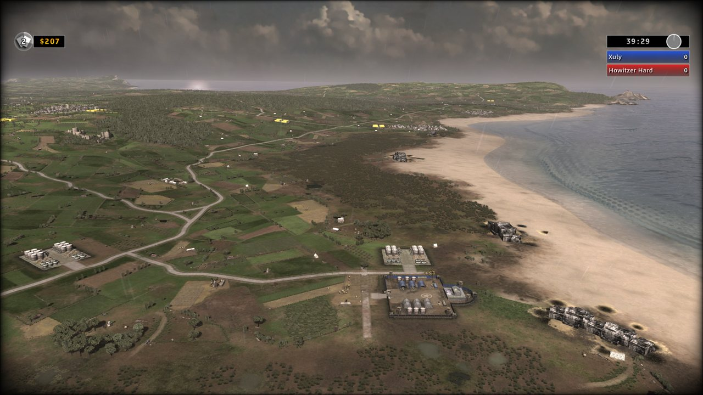
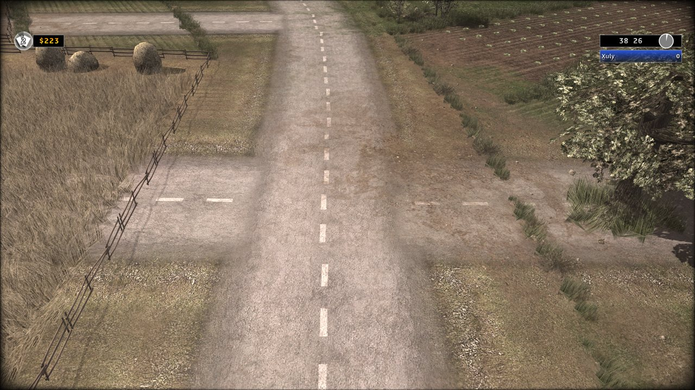
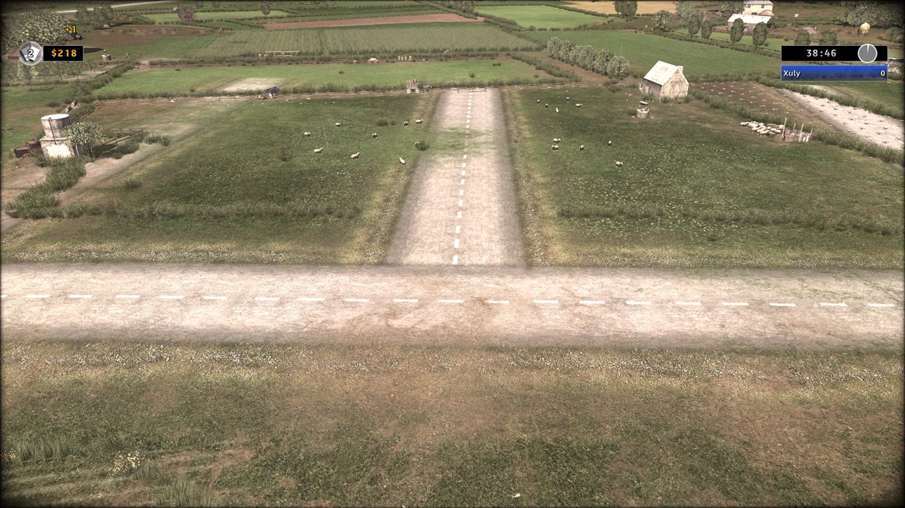
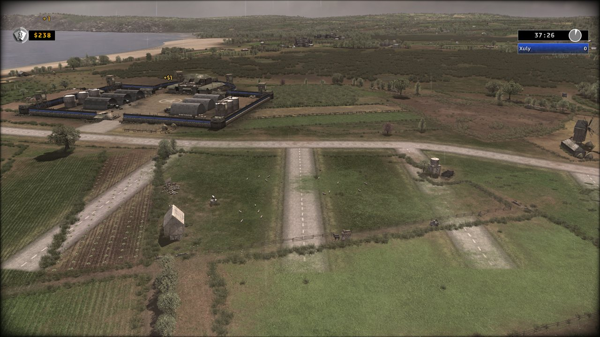

# New roads up close: how they were cracked

New roads drawn in RUSE Studio now look like the map's own roads, from high
up and right down at the ground. This is the story of how we got there, why it took so long, and what it took.

  

## How long

It took a lot of time and a lot of tests: test copies played in the game one after another, a long run of them that
failed, then a handful of probes that each got closer, until the owner's **"holy fuck, we cracked it"**. Roads took
longer than the bridges did ([LESSONS.md](LESSONS.md)).

## The problem

R.U.S.E. draws its maps two ways. From high up, the ground is one big painted picture, and roads are part of that
paint. Close to the ground, the game swaps in finer detail. Our first new roads were painted into the
ground picture in the map's own road colour. From high up they looked right. As soon as the camera came down, they
vanished: the detail the game draws up close had no road in it.

  

## The batches that didn't work

Each batch was a test copy the owner played, zooming in on the new roads:

| What we tried | What the game showed |
|---|---|
| The map's own "road pieces" (curves the map stores for each road) added for the new roads, filed the way the map files its own | Vanished up close |
| The new roads added to the map's 3D road model | Vanished up close |
| The new roads marked in the map's close-up ground map, like its own roads | Vanished up close |
| Four roads stored four different ways, one a copy of the map's own | Vanished up close |
| The road pieces' colour set to bright red | Roads came out blue, from high up only; the close-up road unchanged |
| The road model recoloured red and lifted | Changed from high up only |

The last two finally told us something: everything we had been adding was the **far** road. The road pieces and
the road model are what the game uses from a distance. Whatever drew the road up close was somewhere else, and roads
were put on hold.

## What it turned out to be

When we came back to it, we listed **everything** the map places along one of its own roads, not just things with
"road" in their name. The answer had been there all along: D-Day lays **thousands of asphalt stickers** along its roads.
They're ordinary scenery objects, flat pictures laid on the ground, one every 1,590 map units (about 6 m), each with
an **edge sticker** on either side. Up close, those stickers *are* the road.

Then a run of probes, each a test copy with roads side by side so one look compares them:

1. **Asphalt stickers along a new road:** for the first time, a new road showed up close: asphalt, dashed centre line.
   But pale.
2. **Edge stickers added:** gravel shoulders appeared. Laying the asphalt twice made no difference.
3. **One more file changed:** no difference. That file turned out not to be the one the game reads.
4. **The paint measured on the map's own roads:** ours had been marked twice as strong and twice as wide as the
   map's roads in the close-up ground map, which made a pale band around them. Copying the map's own numbers fixed
   that. Still "barely passes": hard edges, and the map's grass and bushes growing through our road where it met the
   main road.
5. **Five lanes, one change each:** a junction copied from one of D-Day's own, the colour of the nearest road, the
   stickers turned the way D-Day's own dead end has them, and the plants and props on the road's path taken off. The
   last one won: *"it even blends with the grass really nicely ... it's like night and day."*

  
  
  

So a new road is now four things, all built automatically when you draw a road in the Studio:

- **The paint**, measured on the map's own roads (their colour in the middle, their shoulders, their mark in the
  close-up ground map): what you see from high up.
- **The asphalt stickers** the map uses, laid along the road the way the map lays them.
- **The edge stickers**, one either side of each.
- **The path cleared**: the map's plants and props on the road taken off. Woods keep their cover and movement, and
  buildings stay.

  

## Why it took so long

1. **We trusted a name.** The map's road pieces are called `Route` and lie exactly on its roads, so we assumed they
   drew them. The first batches all worked on them: how they're stored, where they're filed, what flags they carry. They
   draw the far road.
2. **We looked for the answer under "road" instead of looking at everything.** The stickers that draw the road up
   close are called asphalt (`Bitume`) and sit in the scenery with the trees and fences. Listing every object along
   one stretch of road found them in minutes. That list should have been the first step.
3. **Some tests changed too much at once, and some results were never written down**. A test that
   changes one thing, with a lane left unchanged beside it, tells you which change mattered. The probes were built
   that way, and every one of them told us something.
4. **"Pale" and "not blending" were turned into numbers late.** The game saves where the camera is with every
   screenshot. Using that to find exactly where our roads were in each picture, then measuring the colours across them
   against the map's own road in the same picture, is what showed the mark was twice too strong and too wide. Before
   that, each fix was a guess at what "looks off" meant.
5. **A wrong turn on one file.** The game keeps two copies of one ground file. For one probe we changed both, thinking
   the second copy might be the one it reads. It isn't, and the probe showed no change. Checking which copy the game
   actually loads came after that test; it should have come before.

## What worked

- **Copying the map instead of inventing numbers.** Every number in the final recipe (spacing, size, edge distance,
  paint colour, how wide the shoulders fade) is measured on the map's own roads, and each map gets its own.
- **Side-by-side lanes, one change each, at one spot:** one test answered several questions at once.
- **The owner's eye, and a second opinion.** The owner's zoom-ins, one mouse-wheel click at a time, showed exactly
  where each version broke. A second AI (ChatGPT) reviewed each plan and caught mistakes before they cost a test.

## Still to come

- Only D-Day has been seen in the game. The desert maps use their own pair of stickers, laid the same way at their
  own spacing; the build uses theirs, untested.
- Roads through woods are cleared of trees for looks, but vehicles still can't drive into the wood there: a wood's
  movement stays as the map has it.
- Junctions and road ends use the plain recipe; D-Day's own junction and end pieces didn't beat it in probe 5, and may
  be tried again later.
